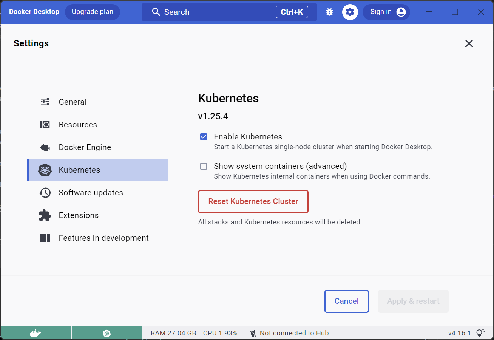
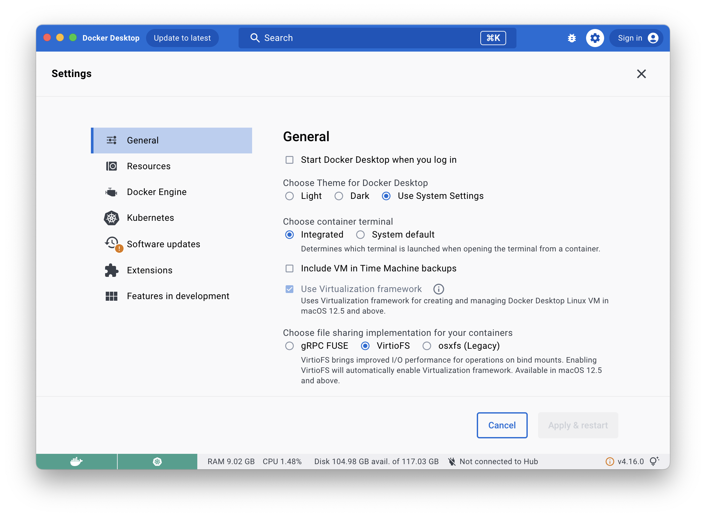
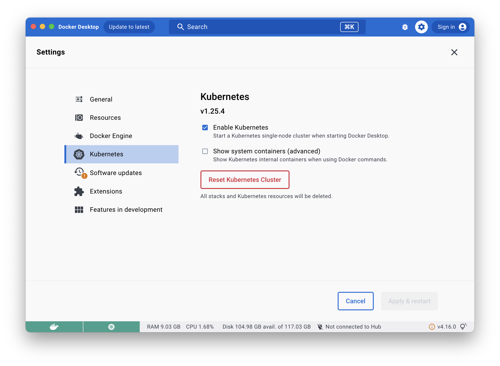
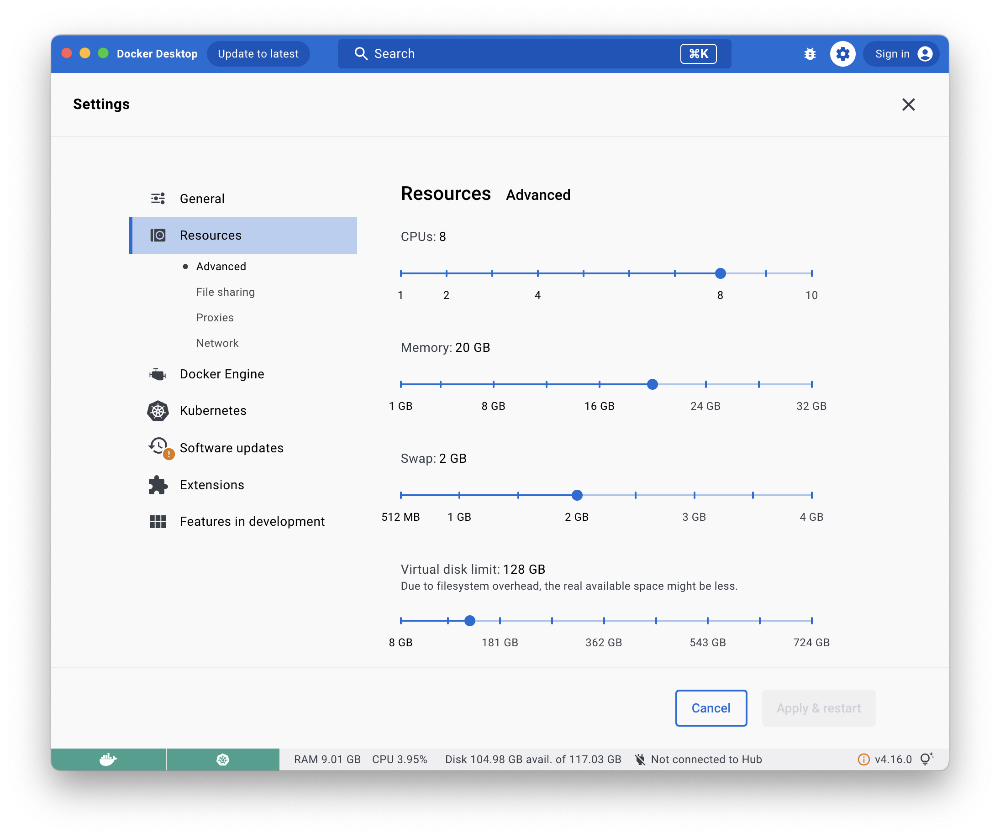
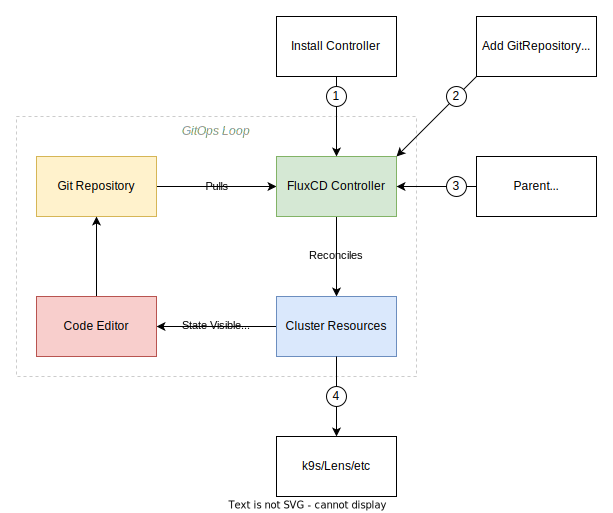
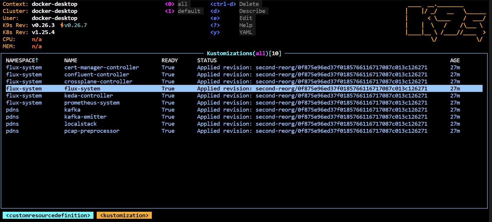

# FluxCD Proof of Concept Repository

_This repository exists to explore, experiment with and report on findings with using FluxCD and a pull based GitOps workflow._


At a high level this feedback loop described by the diagram above works as follows:

1. You make a change to a YAML file(s) and commit your changes and push them to a git repository.
2. The fluxCD controller periodically pulls the repository from git, and looks for changes.
3. Any changes detected get reconciled with any sub object in the cluster that the root controller controls.
4. These reconciled states are now visible to the developer in their local IDE or kubernetes resource viewer _(k9s, lens etc)_.

The rationale for attempting this workflow can be broadly split up into the following goals:

* **Repeatability** - if you want multiple clusters to be in state sync they can all subscribe for changes from the same git repository and branch.
* **Promotion of changes** - If you want to promote changes, simply raise a pull request from the `staging` branch to `main` branch and the clusters (presumably production ones) subscribed to the `main` branch will get the changes reconciled asynchronously, but continuously. 
* **Audit of changes** - since you're using merge requests, there's an audit log in the git repository of changes made, when and by whom, with who approved them.
* **Disaster recovery** - take the above and the realisation you can bootstrap any new cluster provisioned into the state of an existing cluster - useful for cloning test environments as much as bringing up a production environment.

## Bootstrapping

> **NOTE**: _If you're deploying an existing cluster template, you can skip to [deployment](#deploy-existing-cluster-template)._

As you may have noticed, a closed loop needs to start somewhere! Having the git repository representing the state, and a cluster listening to that state from a raw state is called bootstrapping.



Flux provides a CLI tool to do this, as it has to deploy a `GitRepository` object for the source controller to go clone from, as well as the config for the `GitRepository` object, in git. Failure to do this would mean the first time the source controller ran a reconciliation run, it'd detach itself from the repository as the `GitRepository` object containing a upstream reference to itself, would be missing - and thus deleted.

This can be seen in [`gotk-sync.yaml`](clusters/local/flux-system/gotk-sync.yaml), where in the core objects are defined, and link the cluster back to themselves.

To get around this bootstrap paradox the CLI does this all simultaneously - both creating the objects that store the remote urls and config/secrets to pull from them, as well storing the resulting objects it pushes to the cluster in the source try and pushes them before the first reconciliation run starts.

### Example

To create a new cluster template, for example `clusters/abc` with a different combination of services from the components in this repository, you need to use the `flux bootstrap` command.

This also requires a personal access token from Gitlab so that it can insure the repository exists (it'll create it if it doesn't), and if it does can write commits into the tree into the `clusters/` directory. Remember to set the branch you wish to push this new cluster template into.

```bash
export GITLAB_TOKEN= # put your personal access token here with api, read_api and read_repository access
flux bootstrap gitlab --owner=***REMOVED*** --repository=fluxcd-testbed --branch=main --path=./clusters/abc
```

## Deployment

While not strictly related to this repository it's worth having a reference implementation and since most of you reading this will likely have Docker Desktop installed, the write-up will use it as a reference implementation - though if you know what you're doing it should work equally well on Kind, K3d and Rancher Desktop.

### Docker Desktop - Windows

> **WARNING**: _This is all quite memory intensive, an 8GB Windows laptop won't even be able to start a kubernetes cluster in a satisfactory way, let alone applications on top of it, 16GB will be tight, as by default WSL2 sets the maximum memory available to the virtual machine to 50% of the host capacity. 32GB is mostly painless. If you don't have the capacity, consider using a cloud provider to run a cluster._

1. Have WSL2 installed and confirmed working, do first login etc.
1. Have Docker Desktop installed, and confirm the `docker ps` command is working correctly from a WSL shell session.
1. Enable the kubernetes service option in Docker Desktop settings.
   

### Docker Desktop - MacOS

> **WARNING**: _Similar warnings to Windows above, but MacOS requires a step to define the resources available. Don't skip it as the defaults are very conservative._

1. Have Docker Desktop installed, with a confirmation `docker ps` command is working correctly in the MacOS terminal session.
1. Enable the VirtIO option on storage, the default option is extremely slow for host mounted volumes (applies more to docker than kubernetes but solid advice regardless).
   
1. Enable the kubernetes service option in Docker Desktop settings.
   
1. Configure the VM resources for Docker/Kubernetes.
   
   * In this example there's 32GB of system ram to play with, I appreciate that'll be rare, but try to at least provision 10GB. 
   * Storage should also be set to a decent percentage of your host disk space, if only because a lot of these projects move larger files around persistent and ephemeral volumes.
    More CPU cores is better, but total-2 is a decent starting point so your host remains responsive.

### Deploy Existing Cluster Template

To deploy an existing cluster template you need to add a `GitRepository` object that contains a reference to the upstream source, and an initial bootstrapping Kustomization object, which is the parent object for child Kustomizations, HelmCharts and other kubernetes objects.



1. Add the FluxCD controllers to the cluster:
    > **NOTE**: _If you do not specify a cluster context, it'll use the default - but it's best to be explicit. Using `docker-desktop` as the example._

    ```shell
    flux install --context=docker-desktop
    ```

1. Adding a git repository to the FluxCD controller:
    > **NOTE**: _This command will echo an SSH public key string to the terminal, it needs to be added to the repository [deploy keys](https://gitlab.com/***REMOVED***/fluxcd-testbed/-/settings/repository#js-deploy-keys-settings)._

    ```shell
    flux create source git flux-system --url=ssh://git@gitlab.com/***REMOVED***/fluxcd-testbed.git --branch main
    ```

1. Bootstrapping this cluster against a predefined template:

   ```shell
   flux create kustomization flux-system --source="GitRepository/flux-system" --path="./clusters/local" --prune=true --interval=1m 
   ```

1. Check k9s/lens/kubectl for success:

   

For documentation how cluster templates, components and sub components work, follow the README.md chains down the directories. 
For example, start in `./clusters/local/README.md` and follow the links from there.

## Change Promotion

Change promotion is a difficult concept to tackle; you want to retain enough flexibility to play with potential changes you wish - with the caveat there needs to be a clear path to getting it to production should the change be beneficial.

