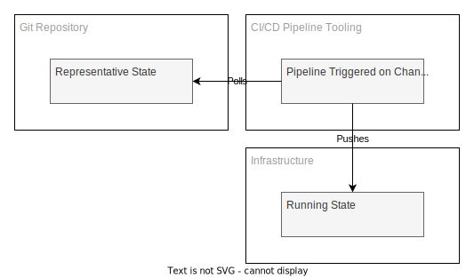
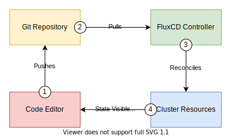
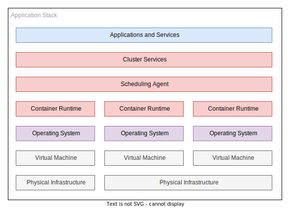
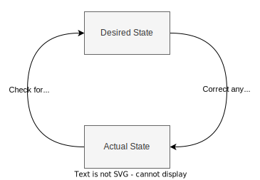
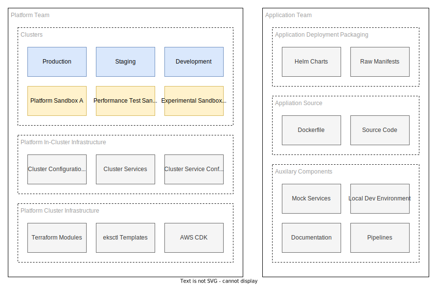
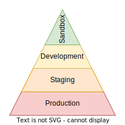
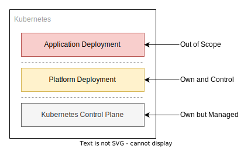
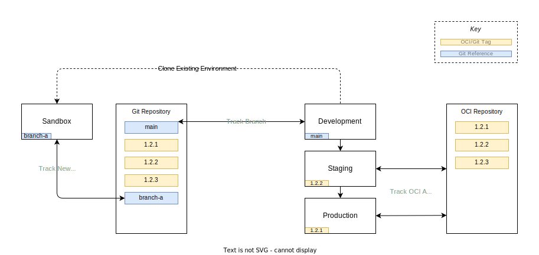
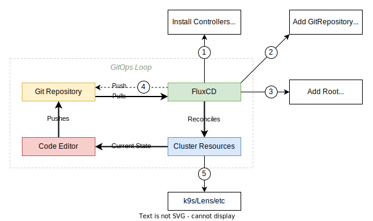
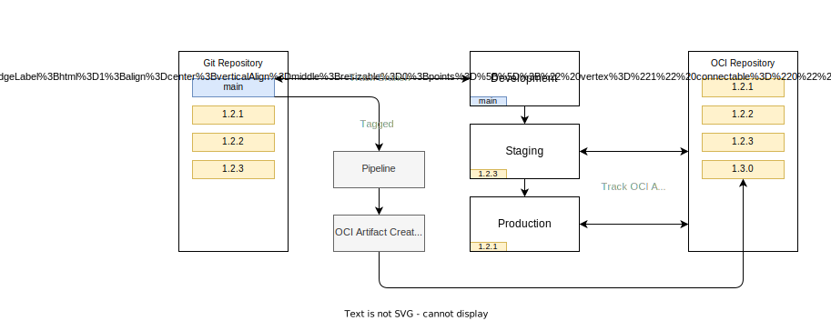

# Kubernetes - A GitOps Story

<!-- markdownlint-disable MD033 -->

This repository exists to store a working proof of concept and notes around how to handle change management as a platform team around kubernetes clusters.

- [Kubernetes - A GitOps Story](#kubernetes---a-gitops-story)
  - [Concept](#concept)
    - [GitOps](#gitops)
      - [Pull vs Push?](#pull-vs-push)
      - [Push Based GitOps](#push-based-gitops)
      - [Pull Based GitOps](#pull-based-gitops)
    - [Kubernetes](#kubernetes)
    - [What Kubernetes Isn't](#what-kubernetes-isnt)
  - [Implementation Planning](#implementation-planning)
    - [Git Repository Structure](#git-repository-structure)
    - [FluxCD - An Introduction](#fluxcd---an-introduction)
    - [Change Control](#change-control)
      - [Sandbox Environments](#sandbox-environments)
    - [GitOps from a Platform Team Perspective](#gitops-from-a-platform-team-perspective)
      - [Source of Truth](#source-of-truth)
      - [Creating Platform Sandboxes](#creating-platform-sandboxes)
    - [GitOps from a Development Team Perspective](#gitops-from-a-development-team-perspective)
    - [Deleting a Sandbox Cluster](#deleting-a-sandbox-cluster)
  - [Working Examples](#working-examples)
    - [Deployment](#deployment)
    - [Clean Up](#clean-up)

> **NOTE**: _High level goals and progress can be tracked against the [goals](GOALS.md) page._

## Concept

Before moving onto problem solving it is a good idea to get all the readers of this document on to a shared level of understanding around the concepts being explored as to properly enable people to critique and contribute to this document. As such this section can be skipped over if you are comfortable with each heading, though skim reading is advised in case term definitions are misaligned.

### GitOps

GitOps in the simplest form is the concept of representing operations state in a git repository with the additional but essential concept that the git repository is the source of truth.

The rationale from this is that infrastructure states become well known, sources of truth are centralised and multiple teams can interact with any given infrastructure configuration with some safety net around simultaneous changes using existing development workflows.

To achieve this, some of the more classical software development life cycle workflows are adopted but only where it makes sense. Not all software development workflows map well to the declarative world of tangible infrastructure, with long lived branching and [gitflow](https://datasift.github.io/gitflow/IntroducingGitFlow.html) style management of changes being the primary example.

#### Pull vs Push?

In addition to encompassing concept of GitOps you have two competing methodologies for utilising git as the source of truth for infrastructure.

A _push workflow_ where in changes are made to a repository and these changes are _pushed_ to resulting clusters to enforce state changes. Any manual changes made in between deployments is effectively overwritten on the next pipeline run, but not before. There is no speculative drift control or warnings things have drifted from the desired state.

A _pull workflow_ where in these changes are stored in the repository but the responsibility on reading these changes and reconciling the state of the infrastructure to match the state of the repository is in the hands of the controllers in the infrastructure itself.

#### Push Based GitOps



In a push GitOps the topology changes get promoted to the cluster by way of a push mechanism - primarily in the form of pipelines. Changes in state that the pipelines are configured to listen to subsequently trigger pipelines, this takes the current state in the commit the pipeline operation is referenced to and sets the infrastructure state to match. Common examples:

- Terraform plan/apply
- Helm upgrade/install

This process only happens at the point of a change in the source code, if you do not change the repository for months then the last time the pipelines will run, by default is months ago. If you have infrastructure that is open to change via other methods, directly via a WebUI or CLI tool like AWS, then you can potentially expect _state drift_.

There are ways to mitigate this; running a pipeline on a schedule regularly to reinforce the state that is stored in git as the source of truth, disabling access to mutate infrastructure via other means, culture changes inside the company around the development lifecycle.

Due to these pain points and the constant fight against the desire to tinker with a system that is human nature - the pull mechanism was born.

#### Pull Based GitOps



The pull based GitOps flow builds on the push based and adds in technology that has the job of _constantly_ reconciling state to a known source of truth - if you fiddle with the state of an environment, the controller of the state will revert your changes back to the state stored in the git repository very quickly, fully and with no manual intervention.

If you want to change the state of this system your only option is to change the git repository state. [^pull-escape-hatch]

[^pull-escape-hatch]: You can just disable the controller enforcing the state in emergencies if you need to mutate production state, but if you are at that stage you are going to be triggering a post-mortem meeting the next working day around why you had to. _Use with care._

Which methodology to use and when to swap between the two is up for debate - most companies will start with a push based methodology, simply because it emulates the flow of travel in existing pipelines used for packaging and releasing code.

### Kubernetes

This section is not intended to explain what kubernetes is in depth and is more aimed as a high level overview. You should concentrate the value proposition, which can be summarised into three main points:

- An abstraction layer between application runtime and operating systems/hardware.
- A state reconciliation engine for your workloads.
- A collection of platform components that are designed to work together.

Instead we will focus on the business value the adoption of kubernetes is advertised to bring, and some painful lessons where it adds more friction than it is worth if you do not adopt it as intended, and wholly.

Runtime abstraction can be loosely redefined as portability - a concept that drove the initial adoption of C and Java decades ago. It has been a laudable goal since the second computer was turned on - how does one take the software engineering effort and reuse it on new hardware?

Kubernetes is just the latest in this nearly century old abstraction on abstraction race to the bottom.

In addition to this generalised abstraction it is worthwhile to acknowledge kubernetes itself is not a platform per se, it is a set of APIs or building blocks that you can craft a platform from. Out the box you do not get persistent storage; networking policies or load balancers - all essential components for the vast majority of workloads you would run on a cluster.

It is perhaps advisable to think of kubernetes as a bucket of poorly sorted lego - all the bricks have a contract where in they promise to click together with another brick but the blocks themselves do not dictate the final product. Kubernetes is much the same, the components are thoroughly tested to maintain compatibility guarantees but there is no single prescribed way to set up a cluster.



In this diagram, kubernetes exerts influence in the red boxes, resting on a linux distribution in purple, itself resting on any abstraction of linux installations; bare metal, virtual machines, cloud instances, which ultimately exist somewhere as physical tin.

The overarching selling point to the kubernetes dream is try to limit the cognitive load of the system components:

- Developers look after the blue boxes.
- Platform team looks after the red area (and if you are fortunate to have it, a different platform team looks after the purple layer).
- Another team looks after the grey layer; be it managed infrastructure like AWS, or an on premises server team who rack servers on your behalf and enrol it into a VMWare virtualised cluster.

Kubernetes attempts to abstract away as much as possible about the underlying infrastructure; from which flavour of linux distribution it is running on top of to which CPU microarchitecture the nodes are running.

Previously felt acute pain points such as creating an RPM package that ran on a specific flavour of CentOS/RHEL. This in turn would slow down the eagerness of the infrastructure teams to patch operating systems under fear of software failures. This does not go away entirely but the abstraction lessens the coupling between the layers, helps create more aligned infrastructure between stages of deployment (development, staging and production) and increased flexibility to change components deeper down the stack relying on the abstractions to take the brunt of the change for you.

To a developer a kubernetes cluster installed on RHEL 7, 8 and 9 as the underlying node operating system should be indistinguishable. [^os-caveat]

[^os-caveat]: Some cutting edge networking technologies in the kubernetes ecosystem rely on modern kernels to do the eBPF magic they do. Older host OS kernel versions will create a feature gap in this scenario.

In addition to this abstraction and isolation principle, kubernetes at its core is a state reconciliation engine. This is _extremely_ important to grok as it might be the most profound and instrumental design choice around the entire ecosystem and it has to be taken into account when designing workloads that are intended to be deployed in a cluster - and failure to account for this design paradigm leads to extremely fragile runtime outcomes.



While it is not a particularly complex system to grasp, it is one infrastructure engineers have been battling since the first person decided to have multiple replicas of a server running in a group and having the audacity to want them to be somewhat similarly configured.

At the core of the kubernetes principle is the idea that you provide a desired state, and the system tries to reconcile that desired state against the current state in the system - correcting for drift as it goes.

If you want nine replicas of a container running and some stop working kubernetes will detect the failures and attempt to bring up replicas until the desired count is realigned with the state desired.

There are many examples of this reconciliation loop in the kubernetes ecosystem; you could argue all objects given to the control plane represent a fixed state the system needs to align to.

This brings us neatly back to GitOps where in a systems state is defined in a git repository - this pattern only works when the control plane you are deploying to can adjust the runtime state of a system and maintain it for you.

This repository will explore the FluxCD project for maintaining a defined state of the kubernetes cluster using its various controllers and custom object types.

Before jumping onto FluxCD, which makes up the bulk of the rest of this project it is worth discussing alternative technologies and where they sit in the problem space. You can not really safely advocate for a technology unless you know its shortcomings, and a reasonable percentage of its shortcomings will come from alternative technologies doing something better, simpler or cheaper.

### What Kubernetes Isn't

You would be forgiven for thinking kubernetes is the silver bullet that all organisations can utilise to deliver more value to the customer; reduce costs in infrastructure, improve deployment cadence and solve world hunger.

Kubernetes in _isolation_ solves **nothing**.

While I appreciate this is an incendiary judgement; as far as I have seen thus far - kubernetes is a force multiplier, but if you start with a force near zero you are not going to get anything out the back of adopting it - and worse, you will likely incur a lot of _**downsides**_.

Consider the following questions:

- **Is your software development lifecycle built around containers (and more recently [WASM](https://developer.okta.com/blog/2022/01/28/webassembly-on-kubernetes-with-rust) runtimes)?**

    Failing to meet this requirement means you will not benefit at all by the adoption of a platform built around orchestrating containers. This may sound obvious but having your software development lifecycle built around containers is more than slapping a Dockerfile in the project root and calling it a day. Development ideally happens in containers, testing almost definitely should happen in containers, build pipelines happen using the containers and ultimately deployment has to work in containers - and not just use them but understand their limitations, what they can enable and the value add they bring to the situation.

- **Is your operations team familiar with operating kubernetes clusters?**

    This one is a catch 22 situation. You can run kubernetes in non production workloads to bootstrap the experience needed and the confidence built around the ecosystem to run it in production. This incurs deeper experience than just reading pod logs with `kubectl` when a pod keeps `CrashLoopBackOff` looping. Understanding how the various parts of the ecosystem relate to each other, and an understanding of the data flow are important to being able to fix things that are not _right_. While kubernetes itself is a state reconciliation engine, at the end of the day a platform teams (and or developers on call) job is to the be the state enforcement loop around the existing software defined loop - should all the automation fail, your job is to reset the system into a state where the usual reconciliation can continue back into a steady state.

- **Do you need to change the size of your workload regularly?**

    Kubernetes is reasonably good at adjusting your workloads to the requirements on the system, but only if you put the effort in. There are various middleware solutions that work in conjunction to try to enable this ideal outcome, though essentially they all operate with the same feedback loop:

  - You monitor a metric.
  - The metric changes.
  - The changed metric dictates a change in the replica count in a deployment.
  - Kubernetes cannot schedule the workload due to lack of nodes thus triggering a rescaling of the cluster.
  - You go back to monitoring a metric.

    There are a lot of moving parts in your average kubernetes cluster and that incurs an operational cost - if you do not need complex operational outcomes, do not use a complex operational cluster system.

- **Do you need to coordinate a workload across multiple geographical regions?**

    It is not impossible to do this with other systems, but the capacity for kubernetes to federate with other clusters to produce a single interaction point across disparate geographical regions can be invaluable.

    Even without cluster federation being able to have multiple clusters in different regions all using the same git repository as a source of truth makes it easier to maintain a geographically dispersed fleet of workloads.

- **Do you need to produce a product that is at worst "cloud agnostic" and at best "platform agnostic"?**

    If you are trying to produce a product/service that can deploy to all the various cloud providers it can be easier if you have a common abstraction between those environments. This is doubly true if you are trying to abstract away enough that a developer should not need to know the difference between an on premises deployment utilising VMWare Tanzu or a cloud deployment running on Google Cloud Platform.

This is just the tip of the iceberg when debating the adoption of kubernetes in your organisation or team, there are as many reasons for and against this course of action as there are permutations of kubernetes cluster you can deploy. Though keep in mind none of these are hard and fast rules and sometimes it can make sense when these are not met - primary example would be you have an existing pool of engineers and developers who have prior experience in this space, then it can make sense to adopt it regardless of the purpose.

Even if you answer all these questions in the direction that would naturally lean towards adopting a kubernetes technology stack in your organisation, it is not the only game in town for this workload management - older and simpler might tick the box for you.

- **RedHat Ansible**

  [Ansible](https://www.redhat.com/en/technologies/management/ansible/what-is-ansible) has been around for a long time and it seems to have won the adoption race between its contemporary rivals of the era; chef and puppet.

  The original, and most adopted design pattern for ansible shuns a state reconciliation loop - instead adopting a "reconcile on push" model (also referred to as _agentless_). This is akin to the GitOps push model discussed earlier in this whitepaper. Ansible in this pattern has no capacity to detect drift in a configuration from the source of truth (the git repository) and instead relies on trying to correct the drift correction at the point the pipeline is triggered to deploy an updated ansible playbook.

  Ansible operates at a lower level of abstraction than kubernetes, and you can deploy a kubernetes cluster itself with ansible - but the lack of constant state reconciliation makes this technology best suited to first run server bootstrapping, infrequently changed deployments and services, and the tooling is focused around configuring operating systems rather than running workloads.

  It is a common pattern to deploy workloads with ansible, but the runtime of the service itself is managed with Systemd or similar - a fire and forget deployment where native linux tooling is engaged with to try to ensure a service keeps running, and what to do when it fails.

  Even with the above, ansible has been bent to work in a pull GitOps approach more recently, with [ansible-pull](https://docs.ansible.com/ansible/latest/cli/ansible-pull.html) - where in ansible runs on a cronjob and pulls the git repository and applies it locally.

- **SaltStack**

  [SaltStack](https://saltproject.io/a-fresh-look-at-saltstack/) essentially tries to solve the same problem that kubernetes does - in respect to reacting to events to change deployments, state drift remediation, and constant feedback loops where the salt minions poll the salt masters for state to resolve while simultaneously reporting their current state.

  What it does not however attempt to do is abstract out the deployment from the operating system - you are still very much at the whims of the host operating system to make your application run.

  From that perspective it solves a majority of the problem but is simpler to operate. This leads to an interesting situation to resolve - if you do not need the abstractions, is it possible to get away with a simpler stack?

  If the answer is yes, you should. Simpler is better, nearly always.

  You can somewhat operate in the grey area between Salt and Kubernetes by using `docker compose` or similar technology to run your workloads in containers, but it can end up more complicated than the benefits will offset. Docker compose is not really designed to orchestrate complicated workloads, and can only operate on a host by host basis which generally leads to awkward interactions with cloud managed components such as load balancers.

  If your workloads are stateless none of this is a problem, however if they are stateful you can end up reimplementing a lot of kubernetes out of the box functionality yourself with Salt and Docker run-times.

- **Hashicorp Nomad**

  [Hashicorp Nomad](https://developer.hashicorp.com/nomad/docs/nomad-vs-kubernetes) exists as a alternative to Kubernetes.

  It is not exclusively focused on containerised workloads; as it can support virtualised, containerised and stand alone applications - this allows you to skip a requirement from the above considerations block.

  Nomad strives to offer less, but do it better - and in some workloads this is an ideal compromise, the difficulty comes from the fact it is a niche and not well adopted solution to the problem which can make hiring for it more difficult and time consuming.

  As of the time of writing it has not adopted the [operator](https://kubernetes.io/docs/concepts/extend-kubernetes/operator/) pattern that is making kubernetes work for many organisations and this is a considerable feature gap.

  Though anyone familiar with kubernetes should have enough baseline knowledge to work with Nomad to offset the niche nature of the product.

- **Hashicorp Packer**

  [Hashicorp Packer](https://www.packer.io/use-cases/automated-machine-images) is an interesting solution to the "I have something I want to run, how can I package it to run?" question. Essentially it is a scriptable build pipeline for creating virtual machine images, including cloud deployments like [EC2 AMIs](https://docs.aws.amazon.com/AWSEC2/latest/UserGuide/AMIs.html). It does not orchestrate, it does not deploy, it does not update your machine nor does it offer any state reconciliation - so why is it on the list?

  It has been a model for a long time to create fixed function virtual machine images and deploy them to a cluster that runs VMs - and this pattern is called a software appliance. All your state, all your update management, all your telemetry is configured at boot time on first deployment. The operating system itself is configured to try and maintain itself - automatic package upgrades, using docker or systemd on the base operating system to run applications.

  It is an old model but for some deployments this can make a lot of sense - it is the ultimate abstraction on hardware - you provide a virtualised hardware platform and run the images directly on it. As long as you can provide the CPU core count, memory and storage requirements for the appliance to run you should have a solid production deployment.

  This model falls apart when you have horizontally scaled workloads that change frequently, or require coordination between dozens of types of applications loosely coupled to each other over the network - it suits monolithic applications.

- **Cloud Provider Driven Serverless Computing**

  Getting it out the way first contrary to some you still have servers to run these workloads - the benefit is you do not need to care about them - so far in that you are powerless to fix them. As far as you are concerned both operationally and as a developer these machines might as well not exist and you only interact with the workloads via APIs.

  Another compelling use case to avoid the complexity of kubernetes completely is to deploy a workload using entirely managed services.

  If you are not tied to needing to support multiple clouds, or on premises deployments, the cost benefit analysis for serverless workloads is often a case of scale and scale alone.

  Running serverless functions 24 hours a day, 7 days a week, will almost always be more expensive than running containers doing the same job. The trade-off is the operational complexity is reduced in exchange for money.

  Serverless applications become their own tangled mess of interconnected parts in similar way kubernetes ones do, but there is a wealth of tooling out there to try and tame this problem.

  Downsides of this methodology include but not limited to:

  - Costs can spiral quickly making budgeting more complex for finance teams.
  - You are often operationally blind when things do not work as prescribed.
  - Your data flow model is the core of your product and the rest of it is tertiary - you need this mindset and maturity to make a serverless model work or you will end up with a spaghetti-themed deployment.
  - Locally mocking out serverless/managed services can be more complicated than running a slimmed down production-alike kubernetes deployment on a local machine, thereby increasing developer feedback loops on changes.

  Conversely upsides include:

  - Someone else cares if the service is running on a infrastructure level.
  - Someone else cares about provisioning more physical hardware when your workload increases.
  - Billing can be easier to isolate with tagging than in monolithic cloud deployments where mixed workloads run along side each other on shared infrastructure.
  - It will almost always be easier to hire for in the current market trajectory - AWS Lambda will be a similar experience for any developer who has worked with it prior.

There are a lot of tools written in this space; a lot of different methodologies, and a lot of disagreement on the trade-off between increasing developer productivity and rapid change feedback loops vs operational complexity and deployment pain.

There is no right answer and on the off chance you ever think you have one; your business needs will change, the underlying technology will change or your staff skills pool will adjust due to attrition thus leaving your previously correct answer in the wrong camp.

## Implementation Planning

Now the concepts are out of the way the rest of this document will be focused on solving a theoretical problem with a bunch of assumed theoretical functional and non-functional requirements.

To help the reader understand what I am trying to build the following statements have been curated.

1. There is **a reason** to have multiple clusters running concurrently, for blast radius on change control and isolation of production data.
1. There is **a reason** to run _sandbox_ clusters that can clone from any cluster; for cost savings and transient use cases.
1. There is **a reason** to have different application configurations in different environments; permits testing a single component in isolation with mocked services.
1. There is **a reason** to run different configurations of infrastructure on each cluster; there should be a baseline assumption all clusters will have the same underlying core resources available in every environment for operational overhead reductions but changes will come in time as the underlying components mature.
1. There is **a reason** to have additional platform and potentially optional components that aren't managed by application teams; Confluent platform, Elastic platform etc.
1. There is **a reason** to have different clusters tracking changes with different cadences and risk appetite, both in the application and platform infrastructure components.

One important take away is to consider the kubernetes platform a rough equivalent to a linux distribution with its opinionated defaults and services. Much like distributions you will need to maintain a support model around multiple simultaneously deployed versions.

### Git Repository Structure

> **SUMMARY:** There's no single solution for laying out git repositories, they all come with trade-offs. Pick the option that gives the most benefits at the current point in time, but be mindful changing retroactively is extremely painful in a production environment.
>
> With that in mind, I'd recommend the model described by FluxCD [here](https://fluxcd.io/flux/guides/repository-structure/#repo-per-team). With the platform team owning whole ownership over the clusters and each stream aligned team owning application repositories. It is a compromise balance between access control and separation of concerns.

There are no prescribed way to lay out a GitOps workflow for kubernetes; this is partially because every business has their own physical topology and the directory topology should represent this rather than be opposed to it. Additionally the concept of directories in the state has no bearing on the cluster state, any directory layout is purely to aid the human cognitive load - you can (and should not) represent an entire kubernetes cluster in a single monolithic YAML document.

An attempt has been made to draw up a topology in this repository that represents a balance between flexibility and declarative rigidity.

[Don't Repeat Yourself](https://en.wikipedia.org/wiki/Don%27t_repeat_yourself) (DRY) is a contentious subject in any system that represents state declaratively, be it Terraform or Kubernetes manifests. As such there is going to be a mix of duplication and inheritance in this project, representing an attempt to strike a balance. This will only be confirmed retroactively when you try to iron out pain points where in too much inheritance ties your hands on changes having too large of a blast radius, and too much duplication adding to the cognitive load and maintenance costs of running many environments.

Having made dozens of passes at this problem before writing up to this point I have settled on this high level cognitive split, a shared responsibility model of sorts.



The shared responsibility in this scenario can be summarised as follows:

- The platform team provide the foundations to build on and as such have a responsibility to be careful with breaking changes, and when they inevitably happen, work in lock step with application teams to test these changes on application stacks.
- The application teams work inside the platform as defined by the platform team as best as they can, raising feature gaps as and when they occur but under the understanding that not all requests can be adhered to as they may be mutually exclusive requirements with another team or the platform itself.

### FluxCD - An Introduction

So with FluxCD v2 selected for the project, here's a high level view of how FluxCD works in the context to making changes to a system:


The feedback loop described by the diagram above works as follows:

1. You make a change to a YAML file(s) and commit your changes and push them to a git repository.
1. The fluxCD source controller periodically pulls the repository from git.
1. The fluxCD kustomize and helm controllers run dry run speculative applies looking for changes if the source commit hash changes.
1. Any changes detected get reconciled with any sub-object in the cluster that the root controller controls.
1. These reconciled states are now visible to the developer in their local IDE or kubernetes resource viewer _(k9s, lens etc)_.

The rationale for adopting this workflow can be broadly split up into the following goals:

- **Repeatability** - if you want multiple clusters to be in state sync they can all subscribe for changes from the same components, with the same versioning scheme.
- **Promotion of changes** - each cluster has a state, enshrined in git; if you want to promote a change it is a case of copying a change from one directory to another and committing the changes.
- **Audit of changes** - since you're using merge requests there is an audit log in the git repository of changes made, when and by whom.
- **Disaster recovery** - since your state is in code, failing over or rebuilding any environment is easier. [^data-footnote]

[^data-footnote]: This process copies the state of a cluster but not the persistent data - underlying persistent data stored in provisioned volumes needs to be treated the same as persistent data on any server - a backup process and restore process needs to be evaluated and tested outside of the infrastructure deployment and cluster deployment lifecycles.

The tangible outcome here for teams is having a source of truth to point to and being reasonably confident that is the current state in the cluster.

The caveat to this is needing notifications of failure to reconcile state. If you push a broken chart and it fails to apply you need to know that it has failed to apply to know the state in the git repo is not the current state in the cluster.

With this brings an improvement to the confidence levels on the cost of a change. If you know the clusters are at a steady known state and you make a change to one cluster, making the same change to other clusters should be less painful.

This isn't because the change itself became less risky but instead because the changes became more visible and repeatable - trying to remove manual steps and the human element to changes. Even if you make a bad change the fact it is tracked and visible to all allows easier attribution of cause to problems while simultaneously giving the power to revert to a known working state.

Increasing confidence levels and reducing risk in changes reduces the cost of change, and reducing the cost of change is the top priority in the vast majority of architectural designs - if only because business needs are constantly changing and the inability to change to meet them is known as technical debt.

Subsequently this allows you to "move fast and break things" and embrace an _agile_ culture around your deliverables. Fear of breaking fragile infrastructure has hamstrung software deployment cadence for as long as infrastructure has been needed to enable value to customers.

### Change Control

We have discussed how to set out a fixed state but we have not looked at how to make changes to this state safely and promote them between clusters.

Developers follow a different change process which will be detailed later, this section is aimed at engineers who maintain the platform components deployed onto every cluster.

Nearly all changes to a system are going to start in sandbox environments where the least amount of users are impacted by the changes, so naturally this is our starting point.

#### Sandbox Environments

> **_Summary_:** Sandboxes encourage or enable the following outcomes:
>
> - Cloning the state of an existing cluster at a point in time.
> - Doing provisional upgrades to the control plane and the core platform services.
> - Allow you to run single user performance tests against known configuration type of cluster.
> - Give application teams an opinionated starting point for doing proof of concept work in a disposable yet repeatable manner that maps easily to downstream environments.

Sandbox environments are commonly thought about but infrequently used, but it is worth explaining why you would go the efforts of engineering to allow these to exist - after all lots of companies do not use them, nor ever find a reason to use them - so why would we?

Most change systems will encourage you to make changes at least impactful end of the system as the alternative would be forced to push fresh untested changes into the bottom of the long lived environment stack (in our model, Development).

Consider this pyramid where in production has many users (who matter the most as they pay for the service), staging as the next largest user base, then development and finally a sandbox which ideally has one engineer or one team as its user base.



This methodology where the development environment is a constantly shifting foundation of potentially broken infrastructure is an **anti pattern**.

It prevents development being used for its primary objective - integration testing. Development is likely to be the first changes made by multiple teams in their own isolated sprints and release schedules will interact with each other. Infrastructure should be the stable aspect in this situation, as to allow developers to find bugs and functional issues in their code without needing to rule out issues in the environmental layer underneath. In a sense it is following the scientific principle of minimising variables and promoting repeatable experiments.

This does not mean changes will never pass though development as it is the first long lived environment on the promotion to production journey but it is expected a vast majority of the showstopping bugs and feature gaps have been addressed in a sandbox prior to this stage.

In addition to facilitating an integration environment, you will likely want to be able to do performance tests.

It is important you conduct this test in such a way that yields full confidence of change to a production platform, and thus you can not escape the reality that you need to run performance tests in an environment as identical in topology and compute resource allocation as production - and that is expensive.

To alleviate the cost prohibitive situation it makes sense the development environment must be scaled down; be it in absolute compute resources such as smaller CPU/memory/disk allocations, or topological differences such as a single node where you would normally have a three node high availability cluster. Staging and other pre-production environments are in themselves considered a long running environment - ideally production-like in their operation, so it is a common pattern to see staging set up with production scaling.

Given the above you still need to perform occasional performance tests - this is just the nature of distributed systems architecture. This is where the concept of a sandbox cluster comes into its own. Utilising the GitOps declarative model you can clone an existing production cluster topology, into a _short lived environment_ where in you can perform a battery of tests against it at the full scale production is running at.

The common practice of compromising and utilising staging as a production testing environment has some negative consequences:

- Performance testing works best with a rapid change feedback loop; make a change, rerun a test, report these configuration changes yield a percentage change against the baseline.
- Staging is not the place for making a rapid feedback loop change.
- Performance testing is often pushing the limits of the system, which incurs breakages and since the staging environment is shared between multiple teams this can become problematic.
- Testing suites often require a known state to run tests against; pre-populated databases etc. A drift away from this stateful but known state can impact performance outcomes.

To summarise; sandbox environments enable you to leave long running clusters isolated to be used for their intended purpose. Additionally they allow you to clone an expensive environment for a few hours of performance testing to increase confidence levels prior to the changes reaching production, or cloning production to try to replicate a production fault in the infrastructure (multi-availability zone scheduling issues for example).

### GitOps from a Platform Team Perspective

At a high level the operational workflow of a platform team is different to a development team but shares many similarities. Much like a microservice having users and thus needing to maintain a contract between client and server, platform teams have a formalised contract of services they provide that can be utilised by application teams.

The differences mostly come from the cadence being set externally; kubernetes itself has an upstream release cadent of three times a year. Many core infrastructure services deployed in a kubernetes cluster will be rapidly changing at this point in the kubernetes maturity cycle. As such the work is more heavily weighted on maintenance than providing additional value. Once there is a stable and relied on baseline platform, application teams will struggle to operate if this moves too quickly - this means changes to deprecate services have to be done conservatively and with a long lead time.

Due to this conservative nature of removing services it would be prudent to be conservative on adding services as this incurs additional maintenance burden and adds to the list of services you will need to run through the deprecation cycle at some point in the future.

In the shared responsibility model talked about prior the platform team gets a hybrid ownership model depending on the scope of their cluster deployment.



In a cloud environment the kubernetes control plane is more than likely to be under the control of the cloud provider by way of a managed service - however that is only a minority of the ownership scope. There is still infrastructure as code modules that have to be maintained to deploy the cloud managed cluster service and all the secondary and tertiary cloud components to make up the platform in its entirety.

> **NOTE:** _While the application layer is out of scope, if you are making changes that you suspect will affect a development team you should deploy application stacks onto your platform sandbox cluster to helm confirm a healthy state is achieved, and if the state isn't - tickets scheduled with the team warning them of upcoming changes that will incur work to be done._

If you take this model with everything resting on the kubernetes control plane (everything below this is out of scope for the platform team) then the most common breaking change pattern will likely be:

1. Upstream kubernetes upgrades are mandated with a breaking change; often promotion of beta APIs to stable or hard removal of alpha and beta API groups.
2. Upstream [Helm charts](https://helm.sh/docs/topics/charts/) that rely on those core APIs will also change and often take the opportunity to include breaking changes when their underlying APIs change.
3. Applications deployed on the cluster will also need to take into account these changing APIs; e.g. [Kyverno](https://kyverno.io/docs/introduction/) policies, Application Load Balancer controller annotations, storage class changes etc.

As you can ascertain the changes at the bottom of the platform are often felt entirely through the stack, as is the nature of foundational changes. Often third parties will attempt to minimise the pain felt by such changes by abstracting the changes in the intermediate layers thereby leaving the application layer none the wiser about the changes below, but this is far from certain.

Hopefully this tumultuous but rapid change will settle in due time as maturity takes hold in the design and deployment cycles of the operators that applications leverage, and core kubernetes API groups reach v1 maturity.

Therefore it is notable that the platform team will be likely at the forefront of the breaking changes and change cycles in a clusters lifecycle. You may even get to a point where application stacks on top of the cluster are quite stable, with very infrequent release schedules for their own internally driven roadmap. This in reality does not markedly reduce the amount of releases a team must make, if only because they will have change thrust upon them from below - directly via kubernetes upgrades and indirectly via shared resources the applications require to run - but these releases will shift to maintenance of a state rather than feature driven deployments.

Aside from the minor and patch version bumping of helm charts in the cluster service deployments, the most common and disruptive task in the platform team would be upgrading the kubernetes control plane itself - at the time of writing the release cadence recently dropped from four releases a year to three, but that still means dealing with this every four months.

The kubernetes control plane has a rolling window of supported API groups which in theory aids the migration and upgrade of clusters. Warnings on deprecation of API groups and object types are made well in advance with some lead times measured in years. This leniency in time pressure around fixing dependencies downstream of the control plane is only useful if you are able to keep on top of the deprecation warnings themselves.

There are tools out there to warn you of upcoming hard deprecations, and when you can expect your cluster state to fail if you upgrade the control plane without changes:

1. [pluto](https://github.com/FairwindsOps/pluto) - _A cli tool to help discover deprecated apiVersions in Kubernetes_
2. [kubent](https://github.com/doitintl/kube-no-trouble) - _Easily check your clusters for use of deprecated APIs_

> **NOTE:** _Both tools offer an overlapping venn diagram of features so evaluate both at the time of reading._

#### Source of Truth

So now you have a grasp on the scope some up coming changes, what's next?

Well you need to create a cluster to try to mitigate the impact of these changes, ideally provisioning the latest version of the control plane as to experiment with the breaking changes ahead of time.

Before making changes to a cluster it is worth talking about the differences between an [OCIRepository](https://fluxcd.io/flux/components/source/ocirepositories/) and a [GitRepository](https://fluxcd.io/flux/components/source/gitrepositories/) source; both can be used interchangeably but you could split them into the former providing stability and strong versioning guarantees and the latter allows you the freedom to track changes using any valid git reference.

> **NOTE:** _Long lived stable clusters **should** track against OCI artifacts. The exception to the rule would be a canary cluster that is just representing the state of `main` branches across the stacks to give you an oversight into the health of the system without any users suffering broken environments. Such an environment would represent the minimum scaling of the cluster for cost reasons, and be non-interactive other than to emit errors to your logging platform._

Taking the example below of [`./clusters/production/flux-system/platform.yaml`](clusters/production/flux-system/platform.yaml) the behaviour the resulting configuration would have in the host cluster:

```yaml
---
apiVersion: source.toolkit.fluxcd.io/v1beta2
kind: OCIRepository
metadata:
  name: platform
  namespace: flux-system
spec:
  secretRef:
    name: platform-repository
  interval: 1m0s
  url: oci://registry.gitlab.com/***REMOVED***/fluxcd-demo
  ref:
    semver: 0.0.x
---
apiVersion: kustomize.toolkit.fluxcd.io/v1
kind: Kustomization
metadata:
  name: platform-services
  namespace: flux-system
spec:
  interval: 1m
  path: ./platform/services
  prune: true
  sourceRef:
    kind: OCIRepository
    name: platform
```

In this configuration the [`./clusters/production/platform.yaml`](clusters/production/platform.yaml) file is tracking OCI artifacts produced in a pipeline - they're versioned by git tag which triggers their packaging and submission to the OCI repository.

Additionally there is [semver](https://semver.org/) version tracking, where in you can follow major, minor and patch versions and the latest of which is re-evaluated at the interval period. [^semver-tracking] The constraints on this behaviour are defined in the `.spec.ref.semver` value and they're evaluated against [this](https://github.com/Masterminds/semver#checking-version-constraints) rule set.

Here are some starting point recommendations for cluster types:

[^semver-tracking]: If you push a `0.0.3` tagged OCI artifact, and `0.0.2` is currently running in the cluster, then the rules above would download the `0.0.3` artifact and trigger reconciliation on the downstream dependencies that use this OCIRepository source.

- **Production**

  Static artifact reference this cluster is a _known_ state at a glance - a fixed tag. (`1.2.3`)

- **Staging**
  
  Somewhat automatic patching this cluster should use a semver range filter and automatically deploy non breaking changes. (`1.2.x` or `1.x.x`)

- **Deployment**
  
  Tracks the `main` branch of the platform stack, with main being considered a rolling source of truth of a working sack. Will by its nature be usually ahead of tagged releases in staging and production, but not always. It is entirely possible that version `1.2.3` is deployed simultaneously to production, staging and development if changes haven't been made in a long time and the last commit in the main branch is also `1.2.3`.

- **Sandbox - Performance Testing**
  
  You would track the same semver or tag version as the source environment/cluster when cloning an environment. Since you are not intending to merge changes back to the source cluster you do not need to branch from main. As such simply copying a cluster directory and bootstrapping it onto a new cluster is sufficient to get going.

- **Sandbox - Platform Changes**

  The primary purpose of a platform sandbox is to make a change. As such the change needs to follow the trunk based development lifecycle of doing some work in a branch, proposing some changes and opening a pull request to bring those changes back into the development cluster.

#### Creating Platform Sandboxes

Since this read-write process is more complex than the read-only process in the performance testing scenario more details are required, and I have prepared an end to end flow for making these changes.



The first action with this diagram the first task is creating a branch in this repository to do work in, branched from `main`.

In this branch you will want to clone the Development environment, as it is set to track against a git repository and branch. However as development is tracking against main the first change you will need to make is to point the branch reference to track your new branch.

```diff
---
apiVersion: source.toolkit.fluxcd.io/v1
kind: GitRepository
metadata:
  name: platform
  namespace: flux-system
spec:
  interval: 1m0s
  ref:
-   branch: main
+   branch: branch-a
  secretRef:
    name: platform-repository
  url: https://gitlab.com/***REMOVED***/fluxcd-demo.git
```

Next step is provisioning your infrastructure as code template to create a working cluster. You will want to ensure the default context is set correctly, as checked via the `kubectl config get-contexts` output or explicitly add `--context` flags for `flux` and `kubectl` commands later.

1. Deploy a new instance of the kubernetes infrastructure of code - incrementing the control plane version or any other baseline modules you have breaking changes in:

   - Kubernetes control plane version being incremented.
   - Core EKS addons versions.
  
1. Since the above GitRepository object has a `.spec.secretRef` for a private repository, you will need to provide a secret to connect to the repository with the same name in the `flux-system` namespace. [Details](https://fluxcd.io/flux/components/source/gitrepositories/#secret-reference) can be found in the FluxCD documentation.
1. Clone the development cluster to a sandbox:

    ```shell
    rsync -av --exclude='*/gotk-sync.yaml' "clusters/development/" "clusters/sandbox-a"
    ```

1. Run FluxCD bootstrap on the new cluster to overwrite the values in the `flux-system` directory in the cluster directory, this is required to connect the reconciliation loop between source and cluster.

    <details>
    <summary>How Flux Boostraps</summary>

    

    1. Install the FluxCD controller objects into the cluster.
    1. Create a `GitRepository` object that references the flags in the bootstrap command.
    1. Add top level root `Kustomization` object to track itself, the fluxCD components are now tracked in the git repository in the `flux-system` directory inside a cluster directory.
    1. These two objects are then committed and pushed to git and then the same objects are pushed to the kubernetes cluster to start the loop.
    1. Finally you can see the reconciliation steps taking place in the cluster with external tooling.
    </details>

1. Make your changes to the cluster state via git commits to the `./clusters/sandbox-a` directory.
1. Validate the changes are success and meet the requirements.
1. Destroy the sandbox kubernetes cluster stack. See [deleting a sandbox cluster](#deleting-a-sandbox-cluster) for details.
1. Copy the directory back to the source location in the current branch and delete the sandbox directory.

    ```shell
    rsync -av --exclude='*/gotk-sync.yaml' "clusters/sandbox-a/" "clusters/development"
    rm -r "clusters/sandbox-a"
    ```

    > **WARNING:** _It is **essential** you do not copy the `gotk-sync.yaml` directory back to the source or the root level `flux-system` kustomization will be sourcing files from the wrong directory._

1. Raise pull request to merge this state into main.

    

1. Monitor the change reconciliation and deployment on the deployment cluster.
1. Adjust any infrastructure as code values for the development cluster to align it to the sandbox. _These must be non-destructive changes._
1. Pushing those changes from Deployment to Staging is a case of tagging the main branch containing the platform components to create an OCI artifact, which gets automatically applied to staging if it is a minor or patch version increment or manually if there are breaking major changes by virtue of changing the OCIRepository object semver range.

    

Finally pushing from staging to Production is a case of incrementing the tagged platform artifact in the OCIRepository object in Production.

To summarise, each stage is slightly more gated than the last:

- Development runs against a git branch (main) and this encourages the main branch of the repository to remain in a "deployable" state.
- Staging has some autonomy to track incrementing artifact versions as and when tagging of the main branch takes place.
- Production has strong versioning gates where in you have to manually increment the deployed version of the platform. It is a compromise state between ease of deployment and adding some checks and balances around automation.

### GitOps from a Development Team Perspective

Congratulations, as a development team your only concern is around the application layer - and while that is not devoid of danger, it is however a lot fewer moving parts to worry about and the ones you do have to are somewhat in your gift to control and change.

At a high level applications are deployed in the same manner as services are in the platform tier; either as helm charts or [kustomized](https://kubernetes.io/docs/tasks/manage-kubernetes-objects/kustomization/) manifests.

In contrast to the platform team, having a repository which owns cluster stacks and the infrastructure as code to deploy these stacks, the application teams are encouraged to make repositories per application. Furthermore the definition of an application is fuzzy, especially in the era of microservices which have sometimes tightly coupled functionality mandating cohabitating deployments.

While there is not a hard and fast definition in this area a good starting point is treating an application as a standalone deployable stack that delivers a service to a customer or user.

> **NOTE:** _It is entirely possible to have nested HelmRelease objects in flux, as the controller listens cluster-wide for objects. This means you can have an "application" that is just a collection of HelmRelease and HelmRepository objects that bring in smaller components and cohabitate them into a single namespace and have a parent object to allow full deletion cleanly of a stack._

In this repository there is the fluxCD default testing helm chart `podinfo` as an example of deploying a chart from another repository.

> **_NOTES FOR LATER_**
>
> - [ ] Cover helm release semver ranges; patch for production, minor for staging and major for development.
> - [ ] Cover container image deployments best practices - tagging etc.
> - [ ] Cover best practices and talk about 12 factor apps.
> - [ ] Emphasise loose decoupling of services, make assumptions the platform is providing things rather than provide them yourself. e.g. Confluent for Kubernetes operators.
> - [ ] Try to make your application namespace agnostic, and deploy _all_ the components in the same namespace for portability.
> - [ ] Trade-offs between helm charts and raw manifests installed via kustomize.
> - [ ] Emphasise the differences between an application and components of the application. Explain trade-offs between stand alone "external" components vs application components.
> - [ ] Mocks are really important and key to isolation of deployment, sometimes you just want to deploy and test a single helm chart in isolation.

### Deleting a Sandbox Cluster

> **NOTE:** _As a nice to have it would be worth scripting the clean down procedure, but it is considerably easier than the existing deletion scripts - list all the kustomizations and helm charts with an annotation or label matching a value indicating they mutate state and then subsequently deleting them via kubectl._
>
> _It makes a lot of sense to start using annotations liberally on this, so you can differentiate between a helm chart of kustomization that provides a custom resource definition and subsequently a controller, and charts which use those. You **must** remove the custom objects before the controllers, or finalisers cannot be triggered and thus you will end up with dangling resources - some of which will cause your IAC to fail when trying to remove a VPC as those resources are likely still bound inside the VPC (Application load balancers etc). Experiments in this area will come later._

1. Suspend the root FluxCD entrypoint to prevent self healing of children objects - `flux suspend ks flux-system`
1. Delete the application HelmReleases/Kustomization objects - this is to trigger the finalisers to clear down external resources; EBS volumes, ALB etc.
1. Return the cluster to its freshly bootstrapped state sans any external state. You should be left with a single `flux-system` kustomization and no HelmRelease objects.
1. Destroy the kubernetes cluster using the infrastructure as code that deployed it initially.

## Working Examples

This repository contains working examples in addition to the document you are currently reading.

### Deployment

To demo multi cluster workflows locally the best option you have is to use [kind](https://kind.sigs.k8s.io/) clusters.

Prerequisites:

- [Docker](https://www.docker.com/products/docker-desktop/)
- [yq](https://github.com/mikefarah/yq)
- [kind](https://kind.sigs.k8s.io/)
- [flux](https://fluxcd.io/flux/cmd/)

For each environment:

1. Create the clusters:

  ```shell
  kind create cluster --config create/$ENV_NAME.yaml
  ```

1. Bootstrap the clusters with FluxCD whilst being mindful of the owner (group path) and repository name:

  ```shell
  export GITLAB_TOKEN=<your personal access token with api, write_repo, read_registry scoped roles>
  flux bootstrap gitlab --token-auth --owner ***REMOVED*** --repository fluxcd-demo --path ./clusters/$ENV_NAME --context kind-$ENV_NAME
  ```

1. Add the Container Registry secret to the `flux-system` namespace so that the platform components can be pulled:

  OCIRepository Platform Artifacts (Production/Staging):

  ```shell
  export GITLAB_USERNAME=<gitlab login email>
  kubectl create secret docker-registry platform-repository --docker-server=registry.gitlab.com --docker-username="$GITLAB_USERNAME" --docker-password="$GITLAB_TOKEN" --namespace flux-system --context kind-$ENV_NAME
  ```

  GitRepository Platform Branch (Deployment/Sandboxes):

  ```shell
  kubectl create secret generic platform-repository -n flux-system --from-literal=username=git --from-literal=password="$GITLAB_TOKEN" --context kind-development
  ```

Now your clusters will be following the state of this repository, as dictated by the `clusters/` directory, and you can check using kubectl to get the status of the kustomization objects:

OCIRepository platform type cluster (note the semver package tack tracked as a current revision):

```shell
> kubectl get kustomizations -n flux-system --context kind-production
NAME                       AGE   READY   STATUS
flux-system                45m   True    Applied revision: main@sha1:32f862f2e10fbaf1f10ff915a6b5b3954ca17037
platform-configs           45m   True    Applied revision: 0.0.6@sha256:a02c5784eafe0f93f92378c806ef94bc5dc7b0e653b65039f1c17178e06ab32a
platform-service-configs   45m   True    Applied revision: 0.0.6@sha256:a02c5784eafe0f93f92378c806ef94bc5dc7b0e653b65039f1c17178e06ab32a
platform-services          45m   True    Applied revision: 0.0.6@sha256:a02c5784eafe0f93f92378c806ef94bc5dc7b0e653b65039f1c17178e06ab32a
```

GitRepository platform type cluster (revision is a git full SHA1 hash of a commit):

```shell
> kubectl get kustomizations -n flux-system --context kind-development
NAME                       AGE   READY   STATUS
flux-system                47m   True    Applied revision: main@sha1:32f862f2e10fbaf1f10ff915a6b5b3954ca17037
platform-configs           47m   True    Applied revision: main@sha1:32f862f2e10fbaf1f10ff915a6b5b3954ca17037
platform-service-configs   47m   True    Applied revision: main@sha1:32f862f2e10fbaf1f10ff915a6b5b3954ca17037
platform-services          47m   True    Applied revision: main@sha1:32f862f2e10fbaf1f10ff915a6b5b3954ca17037
```

Alternatively if you have [taskfile](https://taskfile.dev/) installed - `task create`.

### Clean Up

Since these clusters are local, with no external state being deployed you can safely delete the kind clusters without removing anything flux has provisioned:

```shell
kind delete cluster --name staging
kind delete cluster --name production
kind delete cluster --name development
```

Alternatively if you have [taskfile](https://taskfile.dev/) installed - `task delete`.

---
