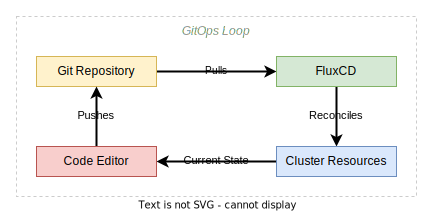

# FluxCD - An Introduction

So with FluxCD v2 selected for the project, here's a high level view of how FluxCD works in the context to making changes to a system:

The feedback loop described by the diagram above works as follows:

1. You make a change to a YAML file(s) and commit your changes and push them to a git repository.
1. The fluxCD source controller periodically pulls the repository from git.
1. The fluxCD kustomize and helm controllers run dry run speculative applies looking for changes if the source commit hash changes.
1. Any changes detected get reconciled with any sub-object in the cluster that the root controller controls.
1. These reconciled states are now visible to the developer in their local IDE or kubernetes resource viewer _(k9s, lens etc)_.

The rationale for adopting this workflow can be broadly split up into the following goals:

- **Repeatability** - if you want multiple clusters to be in state sync they can all subscribe for changes from the same components, with the same versioning scheme.
- **Promotion of changes** - each cluster has a state, enshrined in git; if you want to promote a change it is a case of copying a change from one directory to another and committing the changes.
- **Audit of changes** - since you're using merge requests there is an audit log in the git repository of changes made, when and by whom.
- **Disaster recovery** - since your state is in code, failing over or rebuilding any environment is easier. [^data-footnote]

[^data-footnote]: This process copies the state of a cluster but not the persistent data - underlying persistent data stored in provisioned volumes needs to be treated the same as persistent data on any server - a backup process and restore process needs to be evaluated and tested outside of the infrastructure deployment and cluster deployment lifecycles.

The tangible outcome here for teams is having a source of truth to point to and being reasonably confident that is the current state in the cluster.

The caveat to this is needing notifications of failure to reconcile state. If you push a broken chart and it fails to apply you need to know that it has failed to apply to know the state in the git repo is not the current state in the cluster.

With this brings an improvement to the confidence levels on the cost of a change. If you know the clusters are at a steady known state and you make a change to one cluster, making the same change to other clusters should be less painful.

This isn't because the change itself became less risky but instead because the changes became more visible and repeatable - trying to remove manual steps and the human element to changes. Even if you make a bad change the fact it is tracked and visible to all allows easier attribution of cause to problems while simultaneously giving the power to revert to a known working state.

Increasing confidence levels and reducing risk in changes reduces the cost of change, and reducing the cost of change is the top priority in the vast majority of architectural designs - if only because business needs are constantly changing and the inability to change to meet them is known as technical debt.

Subsequently this allows you to "move fast and break things" and embrace an _agile_ culture around your deliverables. Fear of breaking fragile infrastructure has hamstrung software deployment cadence for as long as infrastructure has been needed to enable value to customers.