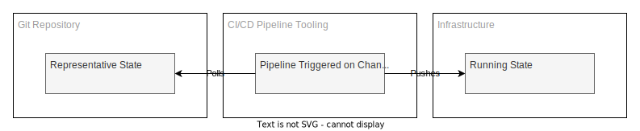

# GitOps

GitOps in the simplest form is the concept of representing operations state in a git repository with the additional but essential concept that the git repository is the source of truth.

The rationale from this is that infrastructure states become well known, sources of truth are centralised and multiple teams can interact with any given infrastructure configuration with some safety net around simultaneous changes using existing development workflows.

To achieve this, some of the more classical software development life cycle workflows are adopted but only where it makes sense. Not all software development workflows map well to the declarative world of tangible infrastructure, with long lived branching and [gitflow](https://datasift.github.io/gitflow/IntroducingGitFlow.html) style management of changes being the primary example.

## Pull vs Push?

In addition to encompassing concept of GitOps you have two competing methodologies for utilising git as the source of truth for infrastructure.

A _push workflow_ where in changes are made to a repository and these changes are _pushed_ to resulting clusters to enforce state changes. Any manual changes made in between deployments is effectively overwritten on the next pipeline run, but not before. There is no speculative drift control or warnings things have drifted from the desired state.

A _pull workflow_ where in these changes are stored in the repository but the responsibility on reading these changes and reconciling the state of the infrastructure to match the state of the repository is in the hands of the controllers in the infrastructure itself.

## Push Based GitOps

In a push GitOps the topology changes get promoted to the cluster by way of a push mechanism - primarily in the form of pipelines. Changes in state that the pipelines are configured to listen to subsequently trigger pipelines, this takes the current state in the commit the pipeline operation is referenced to and sets the infrastructure state to match. Common examples:

- Terraform plan/apply
- Helm upgrade/install

This process only happens at the point of a change in the source code, if you do not change the repository for months then the last time the pipelines will run, by default is months ago. If you have infrastructure that is open to change via other methods, directly via a WebUI or CLI tool like AWS, then you can potentially expect _state drift_.

There are ways to mitigate this; running a pipeline on a schedule regularly to reinforce the state that is stored in git as the source of truth, disabling access to mutate infrastructure via other means, culture changes inside the company around the development lifecycle.

Due to these pain points and the constant fight against the desire to tinker with a system that is human nature - the pull mechanism was born.

## Pull Based GitOps

The pull based GitOps flow builds on the push based and adds in technology that has the job of _constantly_ reconciling state to a known source of truth - if you fiddle with the state of an environment, the controller of the state will revert your changes back to the state stored in the git repository very quickly, fully and with no manual intervention.

If you want to change the state of this system your only option is to change the git repository state. [^pull-escape-hatch]

[^pull-escape-hatch]: You can just disable the controller enforcing the state in emergencies if you need to mutate production state, but if you are at that stage you are going to be triggering a post-mortem meeting the next working day around why you had to. _Use with care._

Which methodology to use and when to swap between the two is up for debate - most companies will start with a push based methodology, simply because it emulates the flow of travel in existing pipelines used for packaging and releasing code.