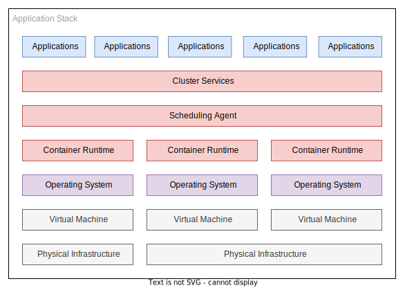
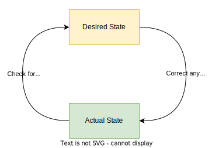

# Kubernetes

This section is not intended to explain what kubernetes is in depth and is more aimed as a high level overview. You should concentrate the value proposition, which can be summarised into three main points:

- An abstraction layer between application runtime and operating systems/hardware.
- A state reconciliation engine for your workloads.
- A collection of platform components that are designed to work together.

Instead we will focus on the business value the adoption of kubernetes is advertised to bring, and some painful lessons where it adds more friction than it is worth if you do not adopt it as intended, and wholly.

Runtime abstraction can be loosely redefined as portability - a concept that drove the initial adoption of C and Java decades ago. It has been a laudable goal since the second computer was turned on - how does one take the software engineering effort and reuse it on new hardware?

## What Kubernetes Can Be

Kubernetes is just the latest in this nearly century old abstraction on abstraction race to the bottom.

In addition to this generalised abstraction it is worthwhile to acknowledge kubernetes itself is not a platform per se, it is a set of APIs or building blocks that you can craft a platform from. Out the box you do not get persistent storage; networking policies or load balancers - all essential components for the vast majority of workloads you would run on a cluster.

It is perhaps advisable to think of kubernetes as a bucket of poorly sorted lego - all the bricks have a contract where in they promise to click together with another brick but the blocks themselves do not dictate the final product. Kubernetes is much the same, the components are thoroughly tested to maintain compatibility guarantees but there is no single prescribed way to set up a cluster.

{ align=left}

The overarching selling point to the kubernetes dream is try to limit the cognitive load of the system components:

- Developers look after the blue boxes. Isolating the cognitive load to their application responsibilities.
- Platform team looks after the red area (and if you are fortunate to have it, a different platform team looks after the purple layer).
- Another team looks after the grey layer; e.g. managed infrastructure like AWS
  
Kubernetes attempts to abstract away as much as possible about the underlying infrastructure; from which flavour of linux distribution it is running on top of to which CPU microarchitecture the nodes are running.

Previously felt acute pain points such as creating an RPM package that ran on a specific flavour of CentOS/RHEL. This in turn would slow down the eagerness of the infrastructure teams to patch operating systems under fear of software failures. This does not go away entirely but the abstraction lessens the coupling between the layers, helps create more aligned infrastructure between stages of deployment (development, staging and production) and increased flexibility to change components deeper down the stack relying on the abstractions to take the brunt of the change for you.

To a developer a kubernetes cluster installed on RHEL 7, 8 and 9 as the underlying node operating system should be indistinguishable. [^os-caveat]

[^os-caveat]: Some cutting edge networking technologies in the kubernetes ecosystem rely on modern kernels to do the eBPF magic they do. Older host OS kernel versions will create a feature gap in this scenario.

In addition to this abstraction and isolation principle, kubernetes at its core is a state reconciliation engine. This is _extremely_ important to grok as it might be the most profound and instrumental design choice around the entire ecosystem and it has to be taken into account when designing workloads that are intended to be deployed in a cluster - and failure to account for this design paradigm leads to extremely fragile runtime outcomes.

{ align=right }

While it is not a particularly complex system to grasp, it is one infrastructure engineers have been battling since the first person decided to have multiple replicas of a server running in a group and having the audacity to want them to be somewhat similarly configured.

At the core of the kubernetes principle is the idea that you provide a desired state, and the system tries to reconcile that desired state against the current state in the system - correcting for drift as it goes.

If you want nine replicas of a container running and some stop working kubernetes will detect the failures and attempt to bring up replicas until the desired count is realigned with the state desired.

There are many examples of this reconciliation loop in the kubernetes ecosystem; you could argue all objects given to the control plane represent a fixed state the system needs to align to.

This brings us neatly back to GitOps where in a systems state is defined in a git repository - this pattern only works when the control plane you are deploying to can adjust the runtime state of a system and maintain it for you.

This repository will explore the FluxCD project for maintaining a defined state of the kubernetes cluster using its various controllers and custom object types.

Before jumping onto FluxCD, which makes up the bulk of the rest of this project it is worth discussing alternative technologies and where they sit in the problem space. You can not really safely advocate for a technology unless you know its shortcomings, and a reasonable percentage of its shortcomings will come from alternative technologies doing something better, simpler or cheaper.

## What Kubernetes Isn't

You would be forgiven for thinking kubernetes is the silver bullet that all organisations can utilise to deliver more value to the customer; reduce costs in infrastructure, improve deployment cadence and solve world hunger.

Kubernetes in _isolation_ solves **nothing**.

While I appreciate this is an incendiary judgement; as far as I have seen thus far - kubernetes is a force multiplier, but if you start with a force near zero you are not going to get anything out the back of adopting it - and worse, you will likely incur a lot of _**downsides**_.

Consider the following questions:

- **Is your software development lifecycle built around containers (and more recently [WASM](https://developer.okta.com/blog/2022/01/28/webassembly-on-kubernetes-with-rust) runtimes)?**

    Failing to meet this requirement means you will not benefit at all by the adoption of a platform built around orchestrating containers. This may sound obvious but having your software development lifecycle built around containers is more than slapping a Dockerfile in the project root and calling it a day. Development ideally happens in containers, testing almost definitely should happen in containers, build pipelines happen using the containers and ultimately deployment has to work in containers - and not just use them but understand their limitations, what they can enable and the value add they bring to the situation.

- **Is your operations team familiar with operating kubernetes clusters?**

    This one is a catch 22 situation. You can run kubernetes in non production workloads to bootstrap the experience needed and the confidence built around the ecosystem to run it in production. This incurs deeper experience than just reading pod logs with `kubectl` when a pod keeps `CrashLoopBackOff` looping. Understanding how the various parts of the ecosystem relate to each other, and an understanding of the data flow are important to being able to fix things that are not _right_. While kubernetes itself is a state reconciliation engine, at the end of the day a platform teams (and or developers on call) job is to the be the state enforcement loop around the existing software defined loop - should all the automation fail, your job is to reset the system into a state where the usual reconciliation can continue back into a steady state.

- **Do you need to change the size of your workload regularly?**

    Kubernetes is reasonably good at adjusting your workloads to the requirements on the system, but only if you put the effort in. There are various middleware solutions that work in conjunction to try to enable this ideal outcome, though essentially they all operate with the same feedback loop:

  - You monitor a metric.
  - The metric changes.
  - The changed metric dictates a change in the replica count in a deployment.
  - Kubernetes cannot schedule the workload due to lack of nodes thus triggering a rescaling of the cluster.
  - You go back to monitoring a metric.

    There are a lot of moving parts in your average kubernetes cluster and that incurs an operational cost - if you do not need complex operational outcomes, do not use a complex operational cluster system.

- **Do you need to coordinate a workload across multiple geographical regions?**

    It is not impossible to do this with other systems, but the capacity for kubernetes to federate with other clusters to produce a single interaction point across disparate geographical regions can be invaluable.

    Even without cluster federation being able to have multiple clusters in different regions all using the same git repository as a source of truth makes it easier to maintain a geographically dispersed fleet of workloads.

- **Do you need to produce a product that is at worst "cloud agnostic" and at best "platform agnostic"?**

    If you are trying to produce a product/service that can deploy to all the various cloud providers it can be easier if you have a common abstraction between those environments. This is doubly true if you are trying to abstract away enough that a developer should not need to know the difference between an on premises deployment utilising VMWare Tanzu or a cloud deployment running on Google Cloud Platform.

This is just the tip of the iceberg when debating the adoption of kubernetes in your organisation or team, there are as many reasons for and against this course of action as there are permutations of kubernetes cluster you can deploy. Though keep in mind none of these are hard and fast rules and sometimes it can make sense when these are not met - primary example would be you have an existing pool of engineers and developers who have prior experience in this space, then it can make sense to adopt it regardless of the purpose.

### Alternatives

Even if you answer all these questions in the direction that would naturally lean towards adopting a kubernetes technology stack in your organisation, it is not the only game in town for this workload management - older and simpler might tick the box for you.

#### RedHat Ansible

  [Ansible](https://www.redhat.com/en/technologies/management/ansible/what-is-ansible) has been around for a long time and it seems to have won the adoption race between its contemporary rivals of the era; chef and puppet.

  The original, and most adopted design pattern for ansible shuns a state reconciliation loop - instead adopting a "reconcile on push" model (also referred to as _agentless_). This is akin to the GitOps push model discussed earlier in this whitepaper. Ansible in this pattern has no capacity to detect drift in a configuration from the source of truth (the git repository) and instead relies on trying to correct the drift correction at the point the pipeline is triggered to deploy an updated ansible playbook.

  Ansible operates at a lower level of abstraction than kubernetes, and you can deploy a kubernetes cluster itself with ansible - but the lack of constant state reconciliation makes this technology best suited to first run server bootstrapping, infrequently changed deployments and services, and the tooling is focused around configuring operating systems rather than running workloads.

  It is a common pattern to deploy workloads with ansible, but the runtime of the service itself is managed with Systemd or similar - a fire and forget deployment where native linux tooling is engaged with to try to ensure a service keeps running, and what to do when it fails.

  Even with the above, ansible has been bent to work in a pull GitOps approach more recently, with [ansible-pull](https://docs.ansible.com/ansible/latest/cli/ansible-pull.html) - where in ansible runs on a cronjob and pulls the git repository and applies it locally.

#### SaltStack

  [SaltStack](https://saltproject.io/a-fresh-look-at-saltstack/) essentially tries to solve the same problem that kubernetes does - in respect to reacting to events to change deployments, state drift remediation, and constant feedback loops where the salt minions poll the salt masters for state to resolve while simultaneously reporting their current state.

  What it does not however attempt to do is abstract out the deployment from the operating system - you are still very much at the whims of the host operating system to make your application run.

  From that perspective it solves a majority of the problem but is simpler to operate. This leads to an interesting situation to resolve - if you do not need the abstractions, is it possible to get away with a simpler stack?

  If the answer is yes, you should. Simpler is better, nearly always.

  You can somewhat operate in the grey area between Salt and Kubernetes by using `docker compose` or similar technology to run your workloads in containers, but it can end up more complicated than the benefits will offset. Docker compose is not really designed to orchestrate complicated workloads, and can only operate on a host by host basis which generally leads to awkward interactions with cloud managed components such as load balancers.

  If your workloads are stateless none of this is a problem, however if they are stateful you can end up reimplementing a lot of kubernetes out of the box functionality yourself with Salt and Docker run-times.

#### Hashicorp Nomad

[Hashicorp Nomad](https://developer.hashicorp.com/nomad/images/nomad-vs-kubernetes) exists as a alternative to Kubernetes.

It is not exclusively focused on containerised workloads; as it can support virtualised, containerised and stand alone applications - this allows you to skip a requirement from the above considerations block.

Nomad strives to offer less, but do it better - and in some workloads this is an ideal compromise, the difficulty comes from the fact it is a niche and not well adopted solution to the problem which can make hiring for it more difficult and time consuming.

As of the time of writing it has not adopted the [operator](https://kubernetes.io/docs/concepts/extend-kubernetes/operator/) pattern that is making kubernetes work for many organisations and this is a considerable feature gap.

Though anyone familiar with kubernetes should have enough baseline knowledge to work with Nomad to offset the niche nature of the product.

#### Hashicorp Packer

[Hashicorp Packer](https://www.packer.io/use-cases/automated-machine-images) is an interesting solution to the "I have something I want to run, how can I package it to run?" question. Essentially it is a scriptable build pipeline for creating virtual machine images, including cloud deployments like [EC2 AMIs](https://docs.aws.amazon.com/AWSEC2/latest/UserGuide/AMIs.html). It does not orchestrate, it does not deploy, it does not update your machine nor does it offer any state reconciliation - so why is it on the list?

It has been a model for a long time to create fixed function virtual machine images and deploy them to a cluster that runs VMs - and this pattern is called a software appliance. All your state, all your update management, all your telemetry is configured at boot time on first deployment. The operating system itself is configured to try and maintain itself - automatic package upgrades, using docker or systemd on the base operating system to run applications.

It is an old model but for some deployments this can make a lot of sense - it is the ultimate abstraction on hardware - you provide a virtualised hardware platform and run the images directly on it. As long as you can provide the CPU core count, memory and storage requirements for the appliance to run you should have a solid production deployment.

This model falls apart when you have horizontally scaled workloads that change frequently, or require coordination between dozens of types of applications loosely coupled to each other over the network - it suits monolithic applications.

#### Cloud Provider Driven Serverless Computing

Getting it out the way first contrary to some you still have servers to run these workloads - the benefit is you do not need to care about them - so far in that you are powerless to fix them. As far as you are concerned both operationally and as a developer these machines might as well not exist and you only interact with the workloads via APIs.

Another compelling use case to avoid the complexity of kubernetes completely is to deploy a workload using entirely managed services.

If you are not tied to needing to support multiple clouds, or on premises deployments, the cost benefit analysis for serverless workloads is often a case of scale and scale alone.

Running serverless functions 24 hours a day, 7 days a week, will almost always be more expensive than running containers doing the same job. The trade-off is the operational complexity is reduced in exchange for money.

Serverless applications become their own tangled mess of interconnected parts in similar way kubernetes ones do, but there is a wealth of tooling out there to try and tame this problem.

Downsides of this methodology include but not limited to:

- Costs can spiral quickly making budgeting more complex for finance teams.
- You are often operationally blind when things do not work as prescribed.
- Your data flow model is the core of your product and the rest of it is tertiary - you need this mindset and maturity to make a serverless model work or you will end up with a spaghetti-themed deployment.
- Locally mocking out serverless/managed services can be more complicated than running a slimmed down production-alike kubernetes deployment on a local machine, thereby increasing developer feedback loops on changes.

Conversely upsides include:

- Someone else cares if the service is running on a infrastructure level.
- Someone else cares about provisioning more physical hardware when your workload increases.
- Billing can be easier to isolate with tagging than in monolithic cloud deployments where mixed workloads run along side each other on shared infrastructure.
- It will almost always be easier to hire for in the current market trajectory - AWS Lambda will be a similar experience for any developer who has worked with it prior.

## Summary

There are a lot of tools written in this space; a lot of different methodologies, and a lot of disagreement on the trade-off between increasing developer productivity and rapid change feedback loops vs operational complexity and deployment pain.

There is no right answer and on the off chance you ever think you have one; your business needs will change, the underlying technology will change or your staff skills pool will adjust due to attrition thus leaving your previously correct answer in the wrong camp.
