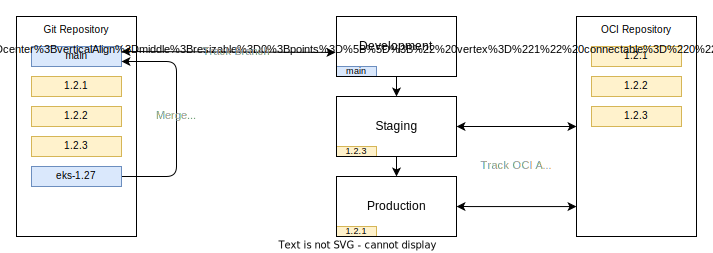

# End to End - From Requirements to Delivery

This page serves as a step by step guide on taking requirements and following a change control system to complete a change request.

## Requirements

Let us imagine a ticket to a platform team where an application team to change the state of the clusters via their platform deployment.

Framing it as a user story helps frame the use case and deliverable.

> **As a** application developer
>
> **I want** utilise the [`KEDA`](https://keda.sh/) service to provide [`ScaledObject`](https://keda.sh/docs/2.0/concepts/scaling-deployments/#scaledobject-spec) functionality on deployments
>
> **So that** I can deploy a horizontally scaled service

!!! note

    It is worth noting that this ticket is asking for a new service, rather than an upgrade to an existing service. 
    
    Adding services is the easiest change, removing them the next easiest and upgrading them is the hardest. This is because adding a service has no current users and a hard deprecation of a service is final - ideally with a lot of forewarning for platform users to have removed the dependency in their applications.

    Upgrading is the most difficult because applications have to be thoroughly tested against a new version of the service. Maintaining a production service through an upgrade cycle is always the most challenging part of the software development lifecycle.

## Planning

The first step to a platform change is to establish if the functionality requested can be achieved in the existing component stack. In this specific example `KEDA` is a wrapper around a built in kubernetes component ([HPA](https://kubernetes.io/docs/tasks/run-application/horizontal-pod-autoscale/)) so the first step would be to check if this functionality can service the needs of the application team. The best component to deploy is none at all.

In this fictional scenario the application team has confirmed they need one of the custom scaler policies provided by `KEDA` and the HPA only being able to scale on basic resource utilisation statistics is not sufficient.

The next step is to scope out if the current kubernetes deployments can support the requested service. The documentation found at [https://keda.sh/docs/2.0/deploy/](https://keda.sh/docs/2.0/deploy/) states the only requirement is a kubernetes cluster version 1.16 or greater.

In this theoretical example the prerequisite is met in all the currently supported environments.

!!! note

    Additionally to reviewing the requirements of the service installation against your supported clusters it is worth doing additional due diligence around the service maturity.

    - Has the service only recently come into being? (risk of unstable API and increased upgrade burden due to rapid changes having to be propagated through the environments)
    - Is the service relying on pre-stable API groups in kubernetes? While not critical it will mean you need to be extra vigilant on kubernetes control plane upgrade change notes for the inevitable loss of the beta API the service relies on.
    - Does the service have a commerical support offering? Examples include Confluent for Kubernetes and Druid/Imply. _These may be requirements for production deployments._

The change request does not necessitate a newer control plane but this may not always be the case - additional planning and testing may be needed if you need to add an external cluster change to internal platform component changes but the same process would be followed with the additional step if pushing a sandbox in the first stage forward on the kubernetes upgrade lifecycle and then propagating those changes up the chain in addition to the internal to the cluster platform deployments.

To summarise:

- The prerequisites of the change request have been met in the current clusters.
- The request is a new service rather than a removal or upgrade of an existing service.
- The request cannot be met using existing components in a different configuration.

## Implementation

First task is to imagine the change control flow and quality gates that are between a platform change and production deployment:

- Creation of a sandbox to do the initial investigation and configuration.
- Promotion of changes from a sandbox to the Development environment.
- Packaging those changes into a versioned artifact for deployment on staging.
- Promotion of this package into production.


!!! note "Note about Application Sandbox use-cases"

    While this end to end guide is primarily focused on a platform team and their change cycle, it is applicable to application teams with some caveats and simplifications:

    - **You don't need to branch the plaform repository (nor you should have the permissions to do so) in order to provision a sandbox.**
      
        This is because you have no need to backport changes into the Development cluster platform components, and it allows you to track the moving but stable state of the Development cluster platform components. If as in this guide you need additional platform components they must go through the platform team change cycle and land on development before they can be synced into the application sandboxes. 

        This may seem long winded but it means you have more confidence on migrating your application level changes back to the Development environment as the platform service components you are working against were deployed there first and identical to your sandbox environment.

    - **By virtue of this you also inherit the platform state from Development.**
  
        Because sandboxes are effectively clones of Development that track Developments upstream platform you can keep them running for extended periods of time where it makes sense. Though in addition to this you would need to run the infrastructure as code pipelines that created the sandbox in the first place occasionally to trigger realignment to match the Kubernetes version running in Development.

    - **Change promotion should be a case of adding, upgrading or removing HelmRelease objects in environments.**

      Your applications need to be components, and components get versioned via HelmRelease version values. As such promotion is as simple as promoting those changes up the chain of environments and testing at each waypoint.

### Provisioning a Platform Sandbox

The first action with this diagram the first task is creating a branch in this repository to do work in, branched from `main`.

In this branch you will want to clone the Development environment, as it is set to track against a git repository and branch. However as Development is tracking against `main` the first change you will need to make is to point the branch reference to track your new branch.

!!! tip

    It is good practice to use a ticket reference in your branch as a prefix followed by hyphenated summary of the branch function

```yaml title="clusters/development/platform.yaml" linenums="1"
--8<-- "clusters/development/platform.yaml:branch"
```

Next step is provisioning your infrastructure as code template to create a working cluster. You will want to ensure the default context is set correctly, as checked via the `kubectl config get-contexts` output or explicitly add `--context` flags for `flux` and `kubectl` commands later.

1. Deploy a new instance of the kubernetes infrastructure of code - incrementing the control plane version or any other baseline modules you have breaking changes in:

   - Kubernetes control plane version being incremented.
   - Core EKS addons versions.
  
1. Since the above GitRepository object has a `.spec.secretRef` for a private repository, you will need to provide a secret to connect to the repository with the same name in the `flux-system` namespace. [Details](https://fluxcd.io/flux/components/source/gitrepositories/#secret-reference) can be found in the FluxCD documentation.
1. Clone the development cluster to a sandbox:

    ```shell
    rsync -av --exclude='*/gotk-sync.yaml' "clusters/development/" "clusters/sandbox-a"
    ```

1. Run FluxCD bootstrap on the new cluster to overwrite the values in the `flux-system` directory in the cluster directory, this is required to connect the reconciliation loop between source and cluster.

At this point you have a point in time snapshot clone of the Development environment - by virtue of creating a branch in the git repository. Now you're free to make changes to the cluster.

### Making Changes in the Sandbox

To install a service like `KEDA` you will need to create a YAML manifest of the components needed to be deployed using FluxCD:

!!! info

    This is just an example for this documentation but most services prefer or mandate to run in their own namespace to make RBAC simpler to implement e.g cert-manager, kyverno.

```yaml title="platform/services/keda.yaml (example)" linenums="1"
--8<--- "docs/manifests/keda.yaml"
```

After committing this file into the relevant branch and directory (platform/services) and pushing, FluxCD will take these three objects and apply them to the cluster and own the reconciliation loop of the objects.

!!! tip

    The upgrade procedure for most charts would be a version bump in the `.spec.chart.spec.version` value and any changes mandated in the `.spec.values` map.

At this point it would be prudent to deploy an example to confirm the installation of the controller.

Firstly a scaler object, so KEDA knows which deployment to monitor and the appropriate scaling behaviour to apply using `kubectl`.

!!! note

    In the teams isolation model, it's not for you as a platform engineer to include a `ScaledObject` object with this change request, the goal is to evaluate if KEDA is working as advertised in our cluster environment and as such this allows application teams to craft their own for their own application needs.

```yaml title="scaler.yaml" linenums="1"
--8<--- "docs/manifests/scaler.yaml"
```

Secondly a job to put some load on the `podinfo` application that was installed in `app-a` namespace as inherited as part of the clone from Development. As this is a once and done job, there's no need to put it into the git repository and I would advise just using `kubectl` to apply and delete the resources as needed. 

Find a balance between rapidly deploying objects to your sandbox and waiting for a GitOps cycle to complete - by that measure just iterate on a local YAML file and then commit it when you're happy with the state and avoid using `kubectl` to create objects with options and arguments.

```yaml title="load-test.yaml" linenums="1"
--8<--- "docs/manifests/load-test.yaml"
```

If all goes well you will get a job running to completion with logs looking similar to the following snippet.

```shell
Running 3m test @ http://podinfo.app-a:9898
  4 threads and 12 connections
  Thread Stats   Avg      Stdev     Max   +/- Stdev
    Latency    31.64ms   45.23ms   1.29s    83.59%
    Req/Sec   301.74    191.35     1.32k    65.79%
  358194 requests in 5.00m, 186.86MB read
Requests/sec:   1193.52
Transfer/sec:    637.56KB
Stream closed EOF for default/load-tester-nb4xq (wrk)       
```

In addition to that, during the duration of the load test you should have noticed the `podinfo` deployment adjusting the replica count and by extension of this, scaling out horizontally.

```shell
$ kubectl top pods --selector=app.kubernetes.io/name=podinfo -n app-a
NAME                    CPU(cores)   MEMORY(bytes)   
podinfo-f7bb67f-gbmjw   3m           13Mi            
podinfo-f7bb67f-lmdxz   95m          29Mi            
podinfo-f7bb67f-td86k   3m           13Mi
```

So at this point we're happy with the deployment and the dummy scaling workload succeeded some light testing. Next step is applying these changes back to the development environment.

### Promoting Changes from Sandboxes to Development

Given the creation of this sandbox started with a branch from `main` it is unsurprising the process to push this change back is in the form of a Merge/Pull request. Raise your request, get some eyes on it, make any changes needed and then merge the resulting outcome.

!!! warning

    It is **essential** you do not copy the `gotk-sync.yaml` directory back to the source or the root level `flux-system` kustomization will be sourcing files from either the wrong directory and/or wrong branch.

So what happens next? Well since Development is tracking the `main` branch, after a short while FluxCD's source controller will detect a change at the next interval and pull the changes. After the SHA1 hash of the resulting pulled commit changes the downstream objects relying on this source will trigger their own reconciliation loops.



After a short while if all goes well the Development cluster will have successfully incorporated your change as defined in YAML in git. If it for whatever reason doesn't go that way, you can either fix forwards with additional changes in the sandbox and re-raise the merge or you can revert the commit and back out of the change.

Both are viable, but try to fix forwards where you can and consider the revert of a commit when the changes have impacted users of the development cluster as unblocking other teams and users is a top priority when trying to navigate the change promotion process.

At this point the change has been promoted to development, any post promotion checking has taken place and the teams who wanted to utilise the service are busy using it in sandboxes of their own automatically as their sandboxes are tracking the main branch of the platform.

### Promoting Changes from Development to Staging/Production

At this point we're reasonably happy with the resulting output in development, an application team has been utilising the service for a few sprints but their work is now complete and they themselves need their application to be promoted from Development to Staging on the path of releasing changes to Production.


Unlike Development, Staging and Production are running _tagged_ bundles of platform components that are published into an OCI Repository (the same repository you're pushing container images in all likelihood).

Take the below example from this repository:

```yaml title="clusters/staging/platform.yaml" linenums="1"
---8<--- "clusters/staging/platform.yaml"
```

FluxCD will be tracking a semver range of patch versions, so if you publish an artifact (which is essentially a .tar.gz bundle of the `platform` directory of this repository) with a tag with an higher patch version, staging will automatically deploy this.

This semi autonomous upgrade behaviour is optional but if you have confidence in your change process and you can rely on patch versioning to be just that, patches, then I'd encourage it.

Once this bundle is running on Staging and any testing has been completed to confirm the state of the system is as desired the next and final step is to promote the change to Production.

Since Production is sacrosanct I would recommend sticking to a fixed tag deployment, so the `.spec.ref.tag` field is fixed to _exactly_ the package you want to run. In addition to putting the final gate on deployment to Production it gives visibility to the platform team what is running on production at any given time. While you get the same outcome using SHA1 hashes on a git branch, those change more frequently and aren't as immediately approachable in the case of an outage.

!!! note

    Final note, you can and should make changes to the platform deployment outside of application team requests, and while it's definitely not always necessary for the platform team to pause promotion of services to production if a team hasn't used them yet - it's definitely preferable. Should the application team decide the request didn't meet their needs it's easier to back a change out of Development, and even Staging than it is once it's in Production.

Congratulations you've taken a feature request from inception to Production.

### Deleting a Sandbox

After the above it's time to clean up.

!!! info

    You should feel comfortable to do so as soon as the merge back to `main`/Development has happened unless you're using it for quick fast follow to fix forward a breaking change in Development.

!!! note

    As a nice to have it would be worth scripting the clean down procedure, but it is considerably easier than the existing deletion scripts - list all the kustomizations and helm charts with an annotation or label matching a value indicating they mutate state and then subsequently deleting them via kubectl._

    It makes a lot of sense to start using annotations liberally on this, so you can differentiate between a helm chart of kustomization that provides a custom resource definition and subsequently a controller, and charts which use those. You **must** remove the custom objects before the controllers, or finalisers cannot be triggered and thus you will end up with dangling resources - some of which will cause your IAC to fail when trying to remove a VPC as those resources are likely still bound inside the VPC (Application load balancers etc). Experiments in this area will come later.

1. Suspend the root FluxCD entrypoint to prevent self healing of children objects - `flux suspend ks flux-system`
1. Delete the application HelmReleases/Kustomization objects - this is to trigger the finalisers to clear down external resources; EBS volumes, ALB etc.
1. Return the cluster to its freshly bootstrapped state sans any external state. You should be left with a single `flux-system` kustomization and no HelmRelease objects.
1. Destroy the Kubernetes cluster using the infrastructure as code that deployed it initially.
