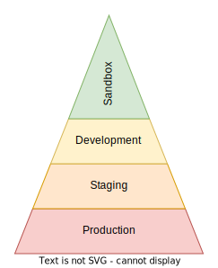
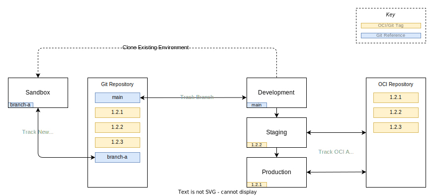
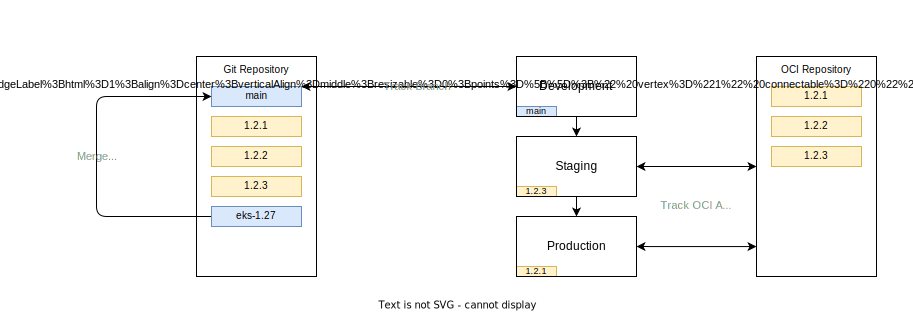
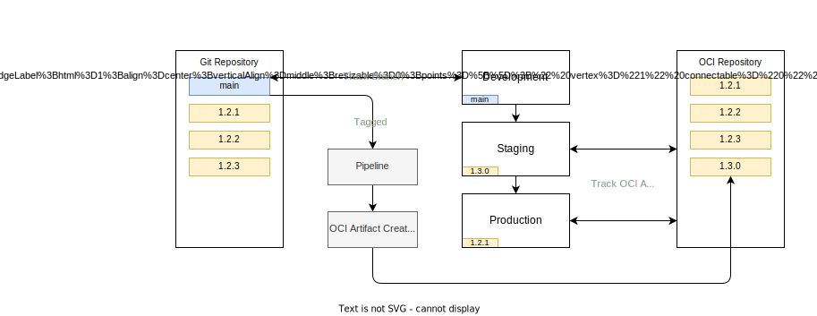

# Change Promotion

We have discussed how to set out a fixed state but we have not looked at how to make changes to this state safely and promote them between clusters.

Developers follow a different change process which will be detailed later, this section is aimed at engineers who maintain the platform components deployed onto every cluster.

Nearly all changes to a system are going to start in sandbox environments where the least amount of users are impacted by the changes, so naturally this is our starting point.

## Sandbox Environments

At a high level - Sandboxes encourage or enable the following outcomes:

- Cloning the state of an existing cluster at a point in time.
- Doing provisional upgrades to the control plane and the core platform services.
- Allow you to run single user performance tests against known configuration type of cluster.
- Give application teams an opinionated starting point for doing proof of concept work in a disposable yet repeatable manner that maps easily to downstream environments.
- Encourage a disposable use and tear down workflow for cost savings.

Sandbox environments are commonly thought about but infrequently used, but it is worth explaining why you would go the efforts of engineering to allow these to exist - after all lots of companies do not use them, nor ever find a reason to use them - so why would we?

Most change systems will encourage you to make changes at least impactful end of the system as the alternative would be forced to push fresh untested changes into the bottom of the long lived environment stack (in our model, Development).

Consider this pyramid where in production has many users (who matter the most as they pay for the service), staging as the next largest user base, then development and finally a sandbox which ideally has one engineer or one team as its user base.

{ align=left }

This methodology where the development environment is a constantly shifting foundation of potentially broken infrastructure is an **anti pattern**.

It prevents development being used for its primary objective - integration testing. Development is likely to be the first changes made by multiple teams in their own isolated sprints and release schedules will interact with each other. Infrastructure should be the stable aspect in this situation, as to allow developers to find bugs and functional issues in their code without needing to rule out issues in the environmental layer underneath. In a sense it is following the scientific principle of minimising variables and promoting repeatable experiments.

This does not mean changes will never pass though development as it is the first long lived environment on the promotion to production journey but it is expected a vast majority of the showstopping bugs and feature gaps have been addressed in a sandbox prior to this stage.

In addition to facilitating an integration environment, you will likely want to be able to do performance tests.

It is important you conduct this test in such a way that yields full confidence of change to a production platform, and thus you can not escape the reality that you need to run performance tests in an environment as identical in topology and compute resource allocation as production - and that is expensive.

To alleviate the cost prohibitive situation it makes sense the development environment must be scaled down; be it in absolute compute resources such as smaller CPU/memory/disk allocations, or topological differences such as a single node where you would normally have a three node high availability cluster. Staging and other pre-production environments are in themselves considered a long running environment - ideally production-like in their operation, so it is a common pattern to see staging set up with production scaling.

Given the above you still need to perform occasional performance tests - this is just the nature of distributed systems architecture. This is where the concept of a sandbox cluster comes into its own. Utilising the GitOps declarative model you can clone an existing production cluster topology, into a _short lived environment_ where in you can perform a battery of tests against it at the full scale production is running at.

The common practice of compromising and utilising staging as a production testing environment has some negative consequences:

- Performance testing works best with a rapid change feedback loop; make a change, rerun a test, report these configuration changes yield a percentage change against the baseline.
- Staging is not the place for making a rapid feedback loop change.
- Performance testing is often pushing the limits of the system, which incurs breakages and since the staging environment is shared between multiple teams this can become problematic.
- Testing suites often require a known state to run tests against; pre-populated databases etc. A drift away from this stateful but known state can impact performance outcomes.

## Platform Sandboxes

At a high level the operational workflow of a platform team is different to a development team but shares many similarities. Much like a microservice having users and thus needing to maintain a contract between client and server, platform teams have a formalised contract of services they provide that can be utilised by application teams.

The differences mostly come from the cadence being set externally; kubernetes itself has an upstream release cadent of three times a year. Many core infrastructure services deployed in a kubernetes cluster will be rapidly changing at this point in the kubernetes maturity cycle. As such the work is more heavily weighted on maintenance than providing additional value. Once there is a stable and relied on baseline platform, application teams will struggle to operate if this moves too quickly - this means changes to deprecate services have to be done conservatively and with a long lead time.

Due to this conservative nature of removing services it would be prudent to be conservative on adding services as this incurs additional maintenance burden and adds to the list of services you will need to run through the deprecation cycle at some point in the future.

In the shared responsibility model talked about prior the platform team gets a hybrid ownership model depending on the scope of their cluster deployment.


In a cloud environment the kubernetes control plane is more than likely to be under the control of the cloud provider by way of a managed service - however that is only a minority of the ownership scope. There is still infrastructure as code modules that have to be maintained to deploy the cloud managed cluster service and all the secondary and tertiary cloud components to make up the platform in its entirety.

> **NOTE:** _While the application layer is out of scope, if you are making changes that you suspect will affect a development team you should deploy application stacks onto your platform sandbox cluster to helm confirm a healthy state is achieved, and if the state isn't - tickets scheduled with the team warning them of upcoming changes that will incur work to be done._

If you take this model with everything resting on the kubernetes control plane (everything below this is out of scope for the platform team) then the most common breaking change pattern will likely be:

1. Upstream kubernetes upgrades are mandated with a breaking change; often promotion of beta APIs to stable or hard removal of alpha and beta API groups.
2. Upstream [Helm charts](https://helm.sh/images/topics/charts/) that rely on those core APIs will also change and often take the opportunity to include breaking changes when their underlying APIs change.
3. Applications deployed on the cluster will also need to take into account these changing APIs; e.g. [Kyverno](https://kyverno.io/images/introduction/) policies, Application Load Balancer controller annotations, storage class changes etc.

As you can ascertain the changes at the bottom of the platform are often felt entirely through the stack, as is the nature of foundational changes. Often third parties will attempt to minimise the pain felt by such changes by abstracting the changes in the intermediate layers thereby leaving the application layer none the wiser about the changes below, but this is far from certain.

Hopefully this tumultuous but rapid change will settle in due time as maturity takes hold in the design and deployment cycles of the operators that applications leverage, and core kubernetes API groups reach v1 maturity.

Therefore it is notable that the platform team will be likely at the forefront of the breaking changes and change cycles in a clusters lifecycle. You may even get to a point where application stacks on top of the cluster are quite stable, with very infrequent release schedules for their own internally driven roadmap. This in reality does not markedly reduce the amount of releases a team must make, if only because they will have change thrust upon them from below - directly via kubernetes upgrades and indirectly via shared resources the applications require to run - but these releases will shift to maintenance of a state rather than feature driven deployments.

Aside from the minor and patch version bumping of helm charts in the cluster service deployments, the most common and disruptive task in the platform team would be upgrading the kubernetes control plane itself - at the time of writing the release cadence recently dropped from four releases a year to three, but that still means dealing with this every four months.

The kubernetes control plane has a rolling window of supported API groups which in theory aids the migration and upgrade of clusters. Warnings on deprecation of API groups and object types are made well in advance with some lead times measured in years. This leniency in time pressure around fixing dependencies downstream of the control plane is only useful if you are able to keep on top of the deprecation warnings themselves.

There are tools out there to warn you of upcoming hard deprecations, and when you can expect your cluster state to fail if you upgrade the control plane without changes:

1. [pluto](https://github.com/FairwindsOps/pluto) - _A cli tool to help discover deprecated apiVersions in Kubernetes_
2. [kubent](https://github.com/doitintl/kube-no-trouble) - _Easily check your clusters for use of deprecated APIs_

> **NOTE:** _Both tools offer an overlapping venn diagram of features so evaluate both at the time of reading._

So now you have a grasp on the scope some up coming changes, what's next?

Well you need to create a cluster to try to mitigate the impact of these changes, ideally provisioning the latest version of the control plane as to experiment with the breaking changes ahead of time.

Before making changes to a cluster it is worth talking about the differences between an [OCIRepository](https://fluxcd.io/flux/components/source/ocirepositories/) and a [GitRepository](https://fluxcd.io/flux/components/source/gitrepositories/) source; both can be used interchangeably but you could split them into the former providing stability and strong versioning guarantees and the latter allows you the freedom to track changes using any valid git reference.

> **NOTE:** _Long lived stable clusters **should** track against OCI artifacts. The exception to the rule would be a canary cluster that is just representing the state of `main` branches across the stacks to give you an oversight into the health of the system without any users suffering broken environments. Such an environment would represent the minimum scaling of the cluster for cost reasons, and be non-interactive other than to emit errors to your logging platform._

Taking the example below of `./clusters/production/platform.yaml` the behaviour the resulting configuration would have in the host cluster:

```yaml
---
apiVersion: source.toolkit.fluxcd.io/v1beta2
kind: OCIRepository
metadata:
  name: platform
  namespace: flux-system
spec:
  secretRef:
    name: platform-repository
  interval: 1m0s
  url: oci://registry.gitlab.com/***REMOVED***/fluxcd-demo
  ref:
    semver: 0.0.x
---
apiVersion: kustomize.toolkit.fluxcd.io/v1
kind: Kustomization
metadata:
  name: platform-services
  namespace: flux-system
spec:
  interval: 1m
  path: ./platform/services
  prune: true
  sourceRef:
    kind: OCIRepository
    name: platform
```

In this configuration the `./clusters/production/platform.yaml` file is tracking OCI artifacts produced in a pipeline - they're versioned by git tag which triggers their packaging and submission to the OCI repository.

Additionally there is [semver](https://semver.org/) version tracking, where in you can follow major, minor and patch versions and the latest of which is re-evaluated at the interval period. [^semver-tracking] The constraints on this behaviour are defined in the `.spec.ref.semver` value and they're evaluated against [this](https://github.com/Masterminds/semver#checking-version-constraints) rule set.

Here are some starting point recommendations for cluster types:

[^semver-tracking]: If you push a `0.0.3` tagged OCI artifact, and `0.0.2` is currently running in the cluster, then the rules above would download the `0.0.3` artifact and trigger reconciliation on the downstream dependencies that use this OCIRepository source.

- **Production**

  Static artifact reference this cluster is a _known_ state at a glance - a fixed tag. (`1.2.3`)

- **Staging**
  
  Somewhat automatic patching this cluster should use a semver range filter and automatically deploy non breaking changes. (`1.2.x` or `1.x.x`)

- **Deployment**
  
  Tracks the `main` branch of the platform stack, with main being considered a rolling source of truth of a working sack. Will by its nature be usually ahead of tagged releases in staging and production, but not always. It is entirely possible that version `1.2.3` is deployed simultaneously to production, staging and development if changes haven't been made in a long time and the last commit in the main branch is also `1.2.3`.

- **Sandbox - Performance Testing**
  
  You would track the same semver or tag version as the source environment/cluster when cloning an environment. Since you are not intending to merge changes back to the source cluster you do not need to branch from main. As such simply copying a cluster directory and bootstrapping it onto a new cluster is sufficient to get going.

- **Sandbox - Platform Changes**

  The primary purpose of a platform sandbox is to make a change. As such the change needs to follow the trunk based development lifecycle of doing some work in a branch, proposing some changes and opening a pull request to bring those changes back into the development cluster.

### Creating Platform Sandboxes

Since this read-write process is more complex than the read-only process in the performance testing scenario more details are required, and I have prepared an end to end flow for making these changes.



The first action with this diagram the first task is creating a branch in this repository to do work in, branched from `main`.

In this branch you will want to clone the Development environment, as it is set to track against a git repository and branch. However as development is tracking against main the first change you will need to make is to point the branch reference to track your new branch.

```diff
---
apiVersion: source.toolkit.fluxcd.io/v1
kind: GitRepository
metadata:
  name: platform
  namespace: flux-system
spec:
  interval: 1m0s
  ref:
-   branch: main
+   branch: branch-a
  secretRef:
    name: platform-repository
  url: https://gitlab.com/***REMOVED***/fluxcd-demo.git
```

Next step is provisioning your infrastructure as code template to create a working cluster. You will want to ensure the default context is set correctly, as checked via the `kubectl config get-contexts` output or explicitly add `--context` flags for `flux` and `kubectl` commands later.

1. Deploy a new instance of the kubernetes infrastructure of code - incrementing the control plane version or any other baseline modules you have breaking changes in:

   - Kubernetes control plane version being incremented.
   - Core EKS addons versions.
  
1. Since the above GitRepository object has a `.spec.secretRef` for a private repository, you will need to provide a secret to connect to the repository with the same name in the `flux-system` namespace. [Details](https://fluxcd.io/flux/components/source/gitrepositories/#secret-reference) can be found in the FluxCD documentation.
1. Clone the development cluster to a sandbox:

    ```shell
    rsync -av --exclude='*/gotk-sync.yaml' "clusters/development/" "clusters/sandbox-a"
    ```

1. Run FluxCD bootstrap on the new cluster to overwrite the values in the `flux-system` directory in the cluster directory, this is required to connect the reconciliation loop between source and cluster.

    <details>
    <summary>How Flux Boostraps</summary>

    

    1. Install the FluxCD controller objects into the cluster.
    1. Create a `GitRepository` object that references the flags in the bootstrap command.
    1. Add top level root `Kustomization` object to track itself, the fluxCD components are now tracked in the git repository in the `flux-system` directory inside a cluster directory.
    1. These two objects are then committed and pushed to git and then the same objects are pushed to the kubernetes cluster to start the loop.
    1. Finally you can see the reconciliation steps taking place in the cluster with external tooling.
    </details>

1. Make your changes to the cluster state via git commits to the `./clusters/sandbox-a` directory.
1. Validate the changes are success and meet the requirements.
1. Destroy the sandbox kubernetes cluster stack. See [deleting a sandbox](#deleting-a-sandbox) for details.
1. Copy the directory back to the source location in the current branch and delete the sandbox directory.

    ```shell
    rsync -av --exclude='*/gotk-sync.yaml' "clusters/sandbox-a/" "clusters/development"
    rm -r "clusters/sandbox-a"
    ```

    > **WARNING:** _It is **essential** you do not copy the `gotk-sync.yaml` directory back to the source or the root level `flux-system` kustomization will be sourcing files from the wrong directory._

1. Raise pull request to merge this state into main.

    

1. Monitor the change reconciliation and deployment on the deployment cluster.
1. Adjust any infrastructure as code values for the development cluster to align it to the sandbox. _These must be non-destructive changes._
1. Pushing those changes from Deployment to Staging is a case of tagging the main branch containing the platform components to create an OCI artifact, which gets automatically applied to staging if it is a minor or patch version increment or manually if there are breaking major changes by virtue of changing the OCIRepository object semver range.

    

Finally pushing from staging to Production is a case of incrementing the tagged platform artifact in the OCIRepository object in Production.

To summarise, each stage is slightly more gated than the last:

- Development runs against a git branch (main) and this encourages the main branch of the repository to remain in a "deployable" state.
- Staging has some autonomy to track incrementing artifact versions as and when tagging of the main branch takes place.
- Production has strong versioning gates where in you have to manually increment the deployed version of the platform. It is a compromise state between ease of deployment and adding some checks and balances around automation.

## Application Sandbox

Congratulations, as a development team your only concern is around the application layer - and while that is not devoid of danger, it is however a lot fewer moving parts to worry about and the ones you do have to are somewhat in your gift to control and change.

At a high level applications are deployed in the same manner as services are in the platform tier; either as helm charts or [kustomized](https://kubernetes.io/images/tasks/manage-kubernetes-objects/kustomization/) manifests.

In contrast to the platform team, having a repository which owns cluster stacks and the infrastructure as code to deploy these stacks, the application teams are encouraged to make repositories per application. Furthermore the definition of an application is fuzzy, especially in the era of microservices which have sometimes tightly coupled functionality mandating cohabitating deployments.

While there is not a hard and fast definition in this area a good starting point is treating an application as a standalone deployable stack that delivers a service to a customer or user.

> **NOTE:** _It is entirely possible to have nested HelmRelease objects in flux, as the controller listens cluster-wide for objects. This means you can have an "application" that is just a collection of HelmRelease and HelmRepository objects that bring in smaller components and cohabitate them into a single namespace and have a parent object to allow full deletion cleanly of a stack._

In this repository there is the fluxCD default testing helm chart `podinfo` as an example of deploying a chart from another repository.

> **_NOTES FOR LATER_**
>
> - [ ] Cover helm release semver ranges; patch for production, minor for staging and major for development.
> - [ ] Cover container image deployments best practices - tagging etc.
> - [ ] Cover best practices and talk about 12 factor apps.
> - [ ] Emphasise loose decoupling of services, make assumptions the platform is providing things rather than provide them yourself. e.g. Confluent for Kubernetes operators.
> - [ ] Try to make your application namespace agnostic, and deploy _all_ the components in the same namespace for portability.
> - [ ] Trade-offs between helm charts and raw manifests installed via kustomize.
> - [ ] Emphasise the differences between an application and components of the application. Explain trade-offs between stand alone "external" components vs application components.
> - [ ] Mocks are really important and key to isolation of deployment, sometimes you just want to deploy and test a single helm chart in isolation.

## Deleting a Sandbox

> **NOTE:** _As a nice to have it would be worth scripting the clean down procedure, but it is considerably easier than the existing deletion scripts - list all the kustomizations and helm charts with an annotation or label matching a value indicating they mutate state and then subsequently deleting them via kubectl._
>
> _It makes a lot of sense to start using annotations liberally on this, so you can differentiate between a helm chart of kustomization that provides a custom resource definition and subsequently a controller, and charts which use those. You **must** remove the custom objects before the controllers, or finalisers cannot be triggered and thus you will end up with dangling resources - some of which will cause your IAC to fail when trying to remove a VPC as those resources are likely still bound inside the VPC (Application load balancers etc). Experiments in this area will come later._

1. Suspend the root FluxCD entrypoint to prevent self healing of children objects - `flux suspend ks flux-system`
1. Delete the application HelmReleases/Kustomization objects - this is to trigger the finalisers to clear down external resources; EBS volumes, ALB etc.
1. Return the cluster to its freshly bootstrapped state sans any external state. You should be left with a single `flux-system` kustomization and no HelmRelease objects.
1. Destroy the kubernetes cluster using the infrastructure as code that deployed it initially.
