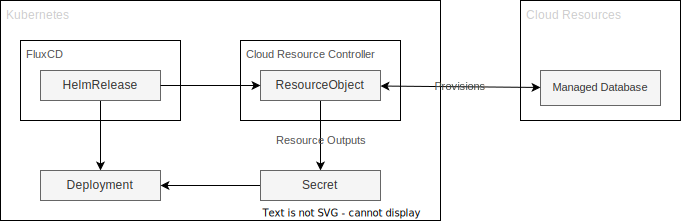

# External Resources

Related to the [loose coupling](../concepts/loose-coupling.md) problems talked about some applications inevitably need to store state and often that state is best serviced in a place outside the kubernetes cluster itself. Databases would be top of the list of resources that make sense to store outside of a cluster, utilising cloud provided managed databases wherever possible.

It is a common pattern to pre-provision these resources prior to installing helm charts and hoping the connection lines up using things like AWS Secrets Manager to lazily pass connection details down to a consuming application, but this model creates issues with shared resources and cleaning up of resources on uninstallation of an application from the cluster.

Given this problem multiple solutions have been build to aid in handling infrastructure from inside your kubernetes manifests natively, so you can deployment alongside your deployments in your helm charts.

- [Crossplane](https://www.crossplane.io/why-control-planes)
- [AWS Controllers for Kubernetes](https://aws-controllers-k8s.github.io/community/)
- [Terranetes](https://terranetes.appvia.io/)
- [TF-controller](https://github.com/weaveworks/tf-controller)
- [Cloud Config](https://cloud.google.com/anthos-config-management/docs/concepts/config-controller-overview)

All of these options follow a similar pattern:

1. Helm chart includes deployments that need externally provisioned resources.
1. FluxCD installs this HelmRelease that includes a custom resource object for the cloud resource.
1. The cloud resource controller picks up the object, provisions it, and returns outputs like connection strings to a kubernetes secret object.
1. Deployment sits in a waiting to schedule state until the secret exists, then when it does, mounts the secret in a path to use in the application.

In addition to the initial provisioning the controller owns the full lifecycle of the resource, and deletion of the Cloud custom object should delete the object via finaliser. This allows a parent HelmRelease object to own both the in cluster compute resources and the external resources and can clean up both.

This process is especially fruitful when you have to combine deployment of resources with security groups in AWS, being able to do so in lock step, and clean them up retroactively on deletion to avoid hanging security groups populating the VPC. Then you can use the returned secrets value for the security group Id to populate the annotation in the deployment helm chart so that the pod can start with the correct security group attached to the pod elastic network interface.

This model might be the only sane model on how to combine kubernetes resources and managed external resources - it has its own challenges but it couples the internal and external resources over a Secret object and ties their life cycles together to installing and uninstalling an application.
