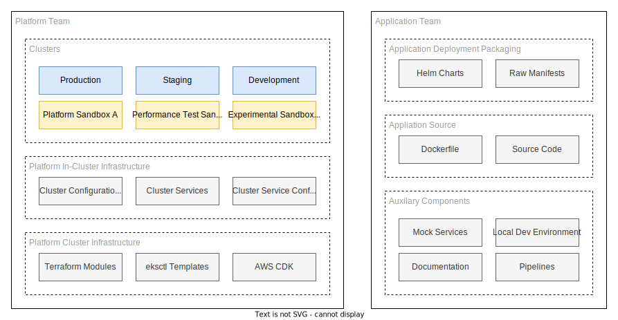

# Git Repository Structure

!!! abstract

    There's no single solution for laying out git repositories, they all come with trade-offs. Pick the option that gives the most benefits at the current point in time, but be mindful changing retroactively is extremely painful in a production environment.

    With that in mind, I'd recommend the model described by FluxCD [here](https://fluxcd.io/flux/guides/repository-structure/#repo-per-team). With the platform team owning whole ownership over the clusters and each stream aligned team owning application repositories. It is a compromise balance between access control and separation of concerns.

    There are no prescribed way to lay out a GitOps workflow for kubernetes; this is partially because every business has their own physical topology and the directory topology should represent this rather than be opposed to it. Additionally the concept of directories in the state has no bearing on the cluster state, any directory layout is purely to aid the human cognitive load - you can (and should not) represent an entire kubernetes cluster in a single monolithic YAML document.

An attempt has been made to draw up a topology in this repository that represents a balance between flexibility and declarative rigidity.

[Don't Repeat Yourself](https://en.wikipedia.org/wiki/Don%27t_repeat_yourself) is a contentious subject in any system that represents state declaratively, be it Terraform or Kubernetes manifests. As such there is going to be a mix of duplication and inheritance in this project, representing an attempt to strike a balance. This will only be confirmed retroactively when you try to iron out pain points where in too much inheritance ties your hands on changes having too large of a blast radius, and too much duplication adding to the cognitive load and maintenance costs of running many environments.

Having made dozens of passes at this problem before writing up to this point I have settled on this high level cognitive split, a shared responsibility model of sorts.

The shared responsibility in this scenario can be summarised as follows:

- The platform team provide the foundations to build on and as such have a responsibility to be careful with breaking changes, and when they inevitably happen, work in lock step with application teams to test these changes on application stacks.
- The application teams work inside the platform as defined by the platform team as best as they can, raising feature gaps as and when they occur but under the understanding that not all requests can be adhered to as they may be mutually exclusive requirements with another team or the platform itself.
