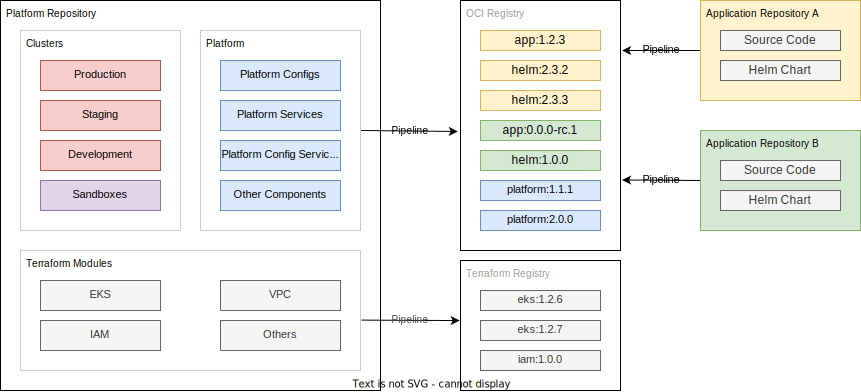

# Kubernetes - Software Development Lifecycle

--8<-- "README.md:intro"

At a high level this is the resulting output and details of the steps to get there, the rationale for the effort incurred to deliver this design and the business outcomes will be found dispersed throughout the documentation.

