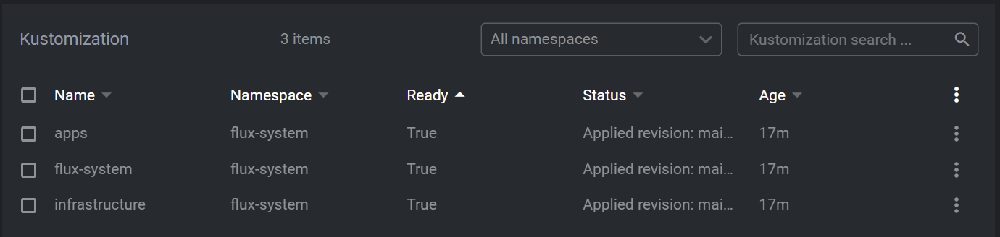
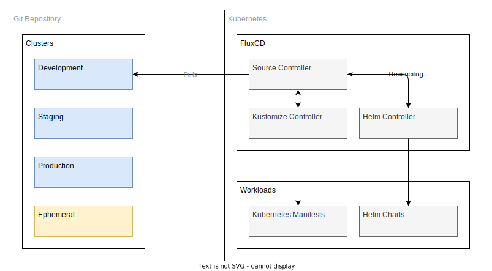
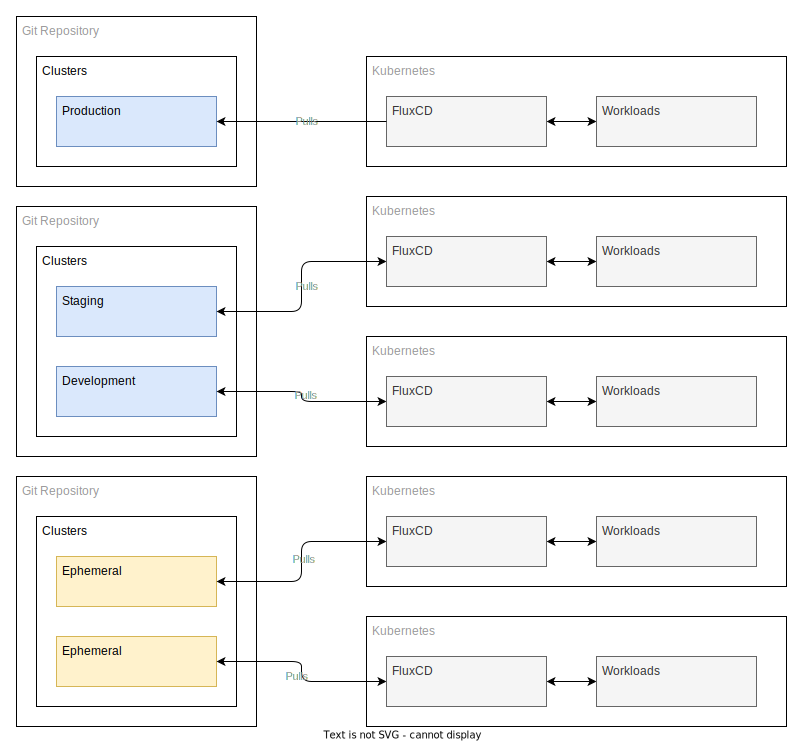
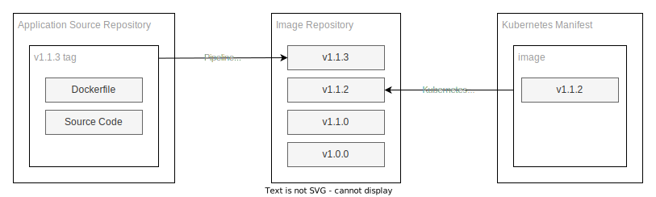
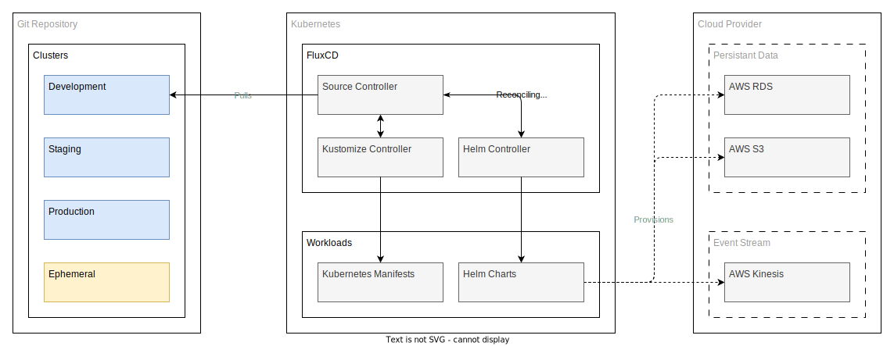

# Kubernetes - Software & Platform Development Lifecycle


_This repository exists to explore, experiment with and report on findings with using FluxCD and a pull based GitOps workflow to enable a software development lifecycle oriented around containers and long lived kubernetes clusters and all the pitfalls found._

## What is a GitOps workflow?

We might as well start with the direction of travel here; why a GitOps workflow at all? Why pull rather than push?

GitOps at its core is the concept of representing operational state in a git repository with a concept of constant reconciliation, trying to incorporate the software development lifecycle methods used by software engineering where appropriate but dropping the bits that make no sense in a declarative environment.

In addition to the overarching concept of GitOps you have two competing methodologies for utilising git sources of truth for deployments; a push workflow where in changes are made to a repository and these changes are _pushed_ to resulting clusters to enforce state changes, and a pull workflow where in these changes are stored in the repository but the associated infrastructure bares the responsibility to keep itself aligned to the state represented in the git repository.

Since Nominet already operates the former this experimental hands on repository is aiming to try and explore the limits of the pull based workflow.

### FluxCD - GitOps Pull deployments

There are two leading technology stacks in the Kubernetes space at the time of writing (early 2023) that aim to solve the problem of pull based gitops deployment flows; ArgoCD and FluxCD.

ArgoCD is the market leader as it currently stands but it suffers some shortcomings making it a little less suited to the task in hand:

* ArgoCD is a monolithic controller that's relatively heavy weight by any standard. All the features are deployed in one go.
* It ships with a WebUI by default to attempt to make the whole process easier, though it detracts from the YAML driven source of truth model.
* It is more suited as a glorified Helm frontend, think iOS app store for Kubernetes. 

FluxCD v2 is a modular continuous deployment product with an emphasis of YAML driven deployments.

* FluxCD can just deploy the bare minimum to get going; a source controller and helm controller.
* It has an optional Web UI that is maturing quickly ([WeaveWorks GitOps](https://github.com/weaveworks/weave-gitops))
* Can be used to represent the full state of a cluster as it bootstraps itself to connect to itself at install time.

So with FluxCD v2 selected for the experiment, here's a high level view of how FluxCD works.


The feedback loop described by the diagram above works as follows:

1. You make a change to a YAML file(s) and commit your changes and push them to a git repository.
2. The fluxCD controller periodically pulls the repository from git, and looks for changes.
3. Any changes detected get reconciled with any sub object in the cluster that the root controller controls.
4. These reconciled states are now visible to the developer in their local IDE or kubernetes resource viewer _(k9s, lens etc)_.

The rationale for adopting this workflow can be broadly split up into the following goals:

* **Repeatability** - if you want multiple clusters to be in state sync they can all subscribe for changes from the same cluster template.
* **Promotion of changes** - each cluster has a state, enshrined in git; if you want to promote a change it's a case of copying a file from one directory to another and committing the changes.
* **Audit of changes** - since you're using merge requests there's an audit log in the git repository of changes made, when and by whom.
* **Disaster recovery** - since your state is in code, failing over or rebuilding any environment (sans data - backup and restore of persistent data is another topic all together) is easy.

## Git Repository Structure

There is no prescribed way to lay out a GitOps workflow for kubernetes; this is partially because every business has their own physical topology and the directory topology should represent this rather than be opposed to it. Additionally the concept of directories in the state has no bearing on the cluster state, any directory layout is purely to aid the human cognitive load - you can (and _shouldn't_) represent an entire kubernetes cluster in a single monolithic YAML document.

With that in mind I've attempted to draw up a topology in this repository that represents a balance between flexibility and declarative rigidity.

_Don't Repeat Yourself_ (DRY) is a contentious subject in any system that represents state declaratively, be it Terraform or Kubernetes manifests. As such there is going to be a mix of duplication and inheritance in this project. This represents an attempt to strike a balance, but this is only confirmed retroactively when you try to iron out pain points where in too much inheritance ties your hands on changes having too large of a blast radius, and too much duplication adding to the cognitive load and maintenance costs of running many environments.

So as a first public draft the following diagram attempts to find those balances, but first - a set of assumptions is being made:

1. There is **a reason** to have templates to represent a _type_ of cluster; allows for bespoke scaling, high availability and other _cost_ incurring differences.
1. There is **a reason** to run multiple clusters that inherit from that _type_ of cluster; it is likely you'll want more than any given template running.
1. There is **a reason** to run _ephemeral_ clusters that can inherit from any _type_ of cluster; for cost savings and transient use cases.
1. There is **a reason** to have different application configurations in different environments; permits testing a single component in isolation with mocked services.
1. There is **not a reason** to run different configurations of infrastructure on each cluster; there should be a baseline assumption all clusters will have the same underlying core resources available in every environment for operational overhead reductions.

The following diagram is an example kafka cluster with the various auxiliary components you may wish to run in such a stack, from the perspective of the `main` branch.

> **NOTE**: _The complexity around making changes and testing them before impacting a group of users is addressed later on in this document._


## Deployment

While not strictly related to this repository it's worth having a reference implementation and since most of you reading this will likely have Docker Desktop installed, the write-up will use it as a reference implementation - though if you know what you're doing it should work equally well on Kind, K3d and Rancher Desktop.

Here is a list of documented environments and how to set up a cluster:

* [Docker Desktop](create/docker-desktop/README.md) - _Preferred option for local hosting._
* [EKS](create/eks/README.md) - _Preferred option for cloud hosting._
* [Kind](create/kind/README.md)

Additional environments are documented in the `/create` directory, and feel free to add more if you can.

### Bootstrapping

As you may have noticed, a closed loop needs to start somewhere! Having the git repository representing the state, and a cluster listening to that state from a raw state is called bootstrapping.

Bootstrapping is used to create the repository if necessary, but if it already exists, will create the `flux-system` kubernetes manifests to get going and commit them to the branch.


Flux provides a CLI tool to do this, as it has to deploy a `GitRepository` object for the source controller to go clone from, as well as the config for the `GitRepository` object, in git. Failure to do this would mean the first time the source controller ran a reconciliation run, it'd detach itself from the repository as the `GitRepository` object containing a upstream reference to itself, would be missing - and thus deleted.

This can be seen in [`gotk-sync.yaml`](clusters/development/flux-system/gotk-sync.yaml), where in the core objects are defined, and link the cluster back to themselves.

To get around this bootstrap paradox the CLI does this all simultaneously - both creating the objects that store the remote urls and config/secrets to pull from them, as well storing the resulting objects it pushes to the cluster in the source try and pushes them before the first reconciliation run starts.

Once this is complete you need to create a `kustomization.yaml` file in the resulting cluster directory, this is effectively a symlink to the cluster-template.

#### Working Example

To create a new cluster template, for example `clusters/abc` with a different combination of services from the components in this repository, you need to use the `flux bootstrap` command.

This also requires a personal access token from Gitlab so that it can insure the repository exists (it'll create it if it doesn't), and if it does can write commits into the tree into the `clusters/` directory. In addition to creating/writing into a repository, the PAT will be used to create a deploy SSH key in the repository, and then submitted to the cluster as a secret to be used to authenticate the `GitRepository` flux object. 

> **WARNING**: _Remember to set the branch you wish to push this new cluster template into, but you really should create the branch first prior as flux will not know which branch to base it from._

```bash
export GITLAB_TOKEN= # put your personal access token here with api, read_api and read_repository access
flux bootstrap gitlab --context=docker-desktop --owner=nominet/cyber/architecture-team --repository=gitops-pull-experiment --branch=main --path=./clusters/abc
```

By default this does the minimum to connect a git repository and a kubernetes cluster together, you still need to tell it which workloads to deploy. After the above process completes you will need to perform a git pull to get the committed changes represented in your local repository and create the above mentioned [`kustomization.yaml` file](https://kubectl.docs.kubernetes.io/references/kustomize/glossary/#kustomization).


```yaml
## ./clusters/abc/kustomization.yaml
apiVersion: kustomize.config.k8s.io/v1beta1
kind: Kustomization
resources:
- flux-system
- ../../cluster-templates/development/
```

The key line is the final one; the first resource will always be `flux-system` as it points to the directory created by the bootstrapping tooling, but the next resource should be a link to the template directory this cluster should track changes from.

All this will do is effectively operate like a symlink to a cluster template directory, and resolve those resources by proxy.

> **NOTE**: _There might not be any value in using templates, it's entirely possible we can just define a production and development cluster in the `./clusters` directory and do a symlink kustomization layer to those existing, long lived clusters. Abstraction for abstractions sake is not as helpful as you might think._

The result of the above process should be some `Kustomization` objects in your cluster. Hopefully resolving down to a ready state shown here via Lens.



### Development Deployments

Sometimes you just want to deploy what is currently defined in git without enforcing a 1:1 correlation between an existing cluster definition and your new local development kubernetes cluster. 

To deploy an existing cluster template you need to add a `GitRepository` object that contains a reference to the upstream source, and an initial bootstrapping `Kustomization` object, which is the parent object for child Kustomizations, HelmCharts and other kubernetes objects.


Steps 2 onwards represents the manual creation of the YAML that the bootstrap command would have committed and pushed to the repository in the `flux-system` directory in `./clusters/$ENVIRONMENT_NAME`

1. Add the FluxCD controllers to the cluster:
    > **NOTE**: _If you do not specify a cluster context, it'll use the default - but it's best to be explicit. Using `docker-desktop` as the example._

    ```shell
    flux install --context=docker-desktop
    ```

1. Adding a git repository to the FluxCD controller:

   #### Using an existing SSH key you already use to push to Gitlab

   > **NOTE**: _This command will echo an SSH public key string to the terminal to add as a deploy key, you can ignore it as it is just the public side of your private personal SSH key._

   ```shell
   flux create source git flux-system --url=ssh://git@gitlab.com/nominet/cyber/architecture-team/gitops-pull-experiment --branch main --private-key-file=${HOME}/.ssh/nominet-gitlab
   ```
   #### Creating a deploy key on your behalf to add to the repository in Gitlab

   > **NOTE**: _This command will echo an SSH public key string to the terminal, it needs to be added to the repository [deploy keys](https://gitlab.com/nominet/cyber/architecture-team/gitops-push-experiment/-/settings/repository#js-deploy-keys-settings)._

   ```shell
   flux create source git flux-system --url=ssh://git@gitlab.com/nominet/cyber/architecture-team/gitops-pull-experiment --branch main
   ```
1. Bootstrapping this cluster against a predefined template:

   ```shell
   flux create kustomization flux-system --context=docker-desktop --source="GitRepository/flux-system" --path="./clusters/development" --prune=true --interval=1m 
   ```

1. Check the cluster for successful deployment (using k9s in this example):

   

For documentation how cluster templates, components and sub components work, follow the README.md chains down the directories. 
For example, start in `./clusters/local/README.md` and follow the links from there.

## Change Promotion

> **NOTE**: _The pattern of moving fast and merging to a central source of truth quickly; shunning long lived branches where possible, can be loosely called Trunk Based development in the software engineering world. However in the infrastructure world it is often the case trunk based development is the **only** pattern that works due to the declarative nature of the code. Production can not be simultaneously running multiple branches of the same declarative infrastructure code, a single branch and a single directory **is the source of truth**._

Change promotion is a difficult concept to tackle; you want to retain enough flexibility to play with potential changes you wish in isolation - with the caveat there needs to be a clear path and if possible, a single route, to getting the proposed to production should the change prove to be beneficial.

Starting with a development environment, how would you promote changes up the environments? Well the question is one of two parts.

1. Kubernetes configuration promotion between environments, but the application image tags remain unchanged.
1. Containerised applications being promoted via a newer tag but the underlying kubernetes manifests are left unchanged.

Doing both at the same time is possible, but the fewer moving parts in an operation the fewer reasons you find to force a rollback to previous state.

### Cluster Configuration Promotion

#### Mono Repository Pattern



In this situation there are multiple directories in the `./clusters` directory in a monorepo, each being a source of truth to a connected fluxCD controller instance - for brevity only the development environment is detailed, though all environments follow the same pattern. 

It is this following the same pattern that enables change promotion to not only be possible, but in theory yielding a predictable outcome when changes are promoted (or reverted).

As this design currently stands, it is a single branch model - you write changes to main, those changes are represented on the resulting clusters in near realtime. As you can imagine this might make production a relatively unsafe. See [Multiple Repository Pattern](#multiple-repository-pattern) for the trade offs of the opposing design.

In the monorepo pattern changes are promoted as such:

There are two work flows:

* A new change, that is not currently reflected on any of the existing long lived environments:
   
   1. Raise a ticket for the work.
   1. Bootstrap an ephemeral cluster to a new branch referencing the ticket to experiment with the changes.  
      You would be attaching an ephemeral cluster to a directory of the environment you are proposing changes for. E.g. `./clusters/development` in branch `NOM-12345` would be reconciled with `ephemeral-cluster-23` without the actual long lived environment of development being altered - it is reconciling changes from the main branch during this process.
   1. Do some development work on the cluster.
   1. On completion, raise a merge request to the main branch.
   1. On merge those changes are propagated to the cluster.

* Promoting a change from a long lived environment up the stack:

   1. Raise a ticket and subsequent git branch off main.
   1. Delete the environment directory locally
   1. Copy the old one in its place e.g. `./clusters/staging/` gets copied to `./clusters/production`.
   1. Commit those changes and push them.
   1. Raise a merge request and get it merged.
   1. Changes propagate to the target cluster.
   1. _OPTIONALLY_: Roll back by reverting the merge request - and the previous state should be reconciled and deployed.
   
#### Multiple Repository Pattern

You can also opt for a multi-repository approach; using the Git provider ACLs to lock down certain repositories to certain users, and prevent direct pushes to the main branch. 

Such a model might look more like this:



While you have traded security and access control on production for speed of change - there is an additional caveat when using a multi-repository approach to GitOps - it massively complicates shared reusable code patterns.

Propagating state between the ephemerals which are their own repositories that developers use, to the bottom end of the long lived environments (development) requires a cross repository copy/paste and merge request action. Development to staging is simpler, single repository at this point, where in a change is a simple folder replacement and merge. Much like ephemeral to development, staging to production needs to cross another git repository boundary, where in the production repository has very strong access filters and merge request requirements to be met to permit a merge.

These models incur manpower costs, engineer time, but facilitate an arguably more secure model to represent the state of your infrastructure. 

The trade-offs are open to debate because like all security postures, they are simply an evaluation of risk vs reward.

#### Ephemeral Environments

We have touched on these repeatedly before, but it is worth explaining why you would go the extremes of engineering to allow these to exist - after all lots of companies do not use them, nor ever find a reason to use them - so why would we?

Regardless of a monorepo, or multi repo topology - you still want scratch environments to propose working changes on - if not, you would be forced to push fresh untested changes into the bottom of the long lived environment stack (in our model, Development).

This situation where the development environment is a shifting sands of potential broken infrastructure is an anti pattern, it prevents development being used for its primary objective - integration testing. Development is likely to be the first environment changes made by multiple teams, in their own isolated sprints and release schedules will interact with each other. With this in mind and as mentioned before about minimising moving parts in any given change - infrastructure should be the stable aspect in this situation, as to allow developers to find bugs and functional issues in their code without pointing their fingers at the environmental layer underneath.

In addition to facilitating an integration environment, you will want to be able to do performance tests. 

It is important you conduct this test in such a way that yields full confidence of change to a production platform, and thus you can not escape the reality that you need to run performance tests in an environment as identical in topology and compute resource allocation as production - and that is expensive.

To alleviate such a situation staging and other pre-production environments must be scaled down; be it in absolute compute resources such as smaller CPU/Memory/Disk allocations, or topological differences such as a single node where you would normally have a three node high availability cluster. Staging and other pre-production environments are in themselves considered a long running environment - ideally production like in their operation. 

Alerting and monitoring should be applied to these environments, but with out of hours alerting disabled - this is important as some infrastructure changes will be oriented around monitoring and you do not want to find out something did not work as expected the following morning when alerts did not fire in production.

Given all the above you still need to perform performance tests - this is just the nature of distributed systems architecture. This is where the concept of an ephemeral cluster comes into its own. Utilising the GitOps declarative model you can clone an existing production cluster topology, into a _short lived environment_ where in you can perform a battery of tests against it at the full scale production is running at. 

The emphasis here is squarely on a short lived environment. It should be possible from any given state to clone the cluster configuration (without persistent data - this is outside the scope of GitOps) and transplant it into similar infrastructure, in this case a Kubernetes cluster.

To summarise; ephemeral environments enable you to leave long running clusters alone so they can be used for their intended developer purpose and make infrastructure or cluster configuration changes in throwaway scratch environments and also allow you to clone an expensive environment for a few hours of performance testing to increase confidence levels prior to the changes reaching production.

To create an ephemeral cluster in this workflow:

1. Cloning this repository.
1. Create a branch off main.
1. Create a kubernetes cluster that you have access to via kubectl.
1. Run `flux bootstrap` on this branch, in the directory representing the cluster state you want to clone. e.g. bootstrap `./clusters/development` in the `TEST-1234` ticket branch. This will override the existing `flux-system` configuration and tie this branch and configuration to a new cluster.
1. Ephemeral cluster reconciles and deploys the same resources as the existing cluster in a few minutes.

To delete the cluster:

1. Run `flux uninstall` on the cluster, so all the flux created resources are destroyed.
1. Delete the kubernetes cluster.
1. Delete the temporary git remote branch.

This workflow is largely designed for testing tasks; such as performance testing, integration testing of new components prior to getting deployed to development. Though it can be used to prototype reconfiguration of any long lived environment. 

The most common task to achieve in this workflow would be the upgrading of the underlying kubernetes cluster itself - doing so on development directly would leave the cluster in a broken state for stream aligned teams to continue their work, but platform teams still need to do the work - the solution is using the ephemeral clusters.

In this workflow:

1. Clone the state of the existing development cluster onto a newer installation of the kubernetes control plane.
1. Do the fixes, document what has changed that might be pertinent to developers such as API deprecations.
1. Raise merge request between the `PLATFORM-1234` branch to `main` for development, sans the modified `kube-system` directory (specific to each physical deployment).
1. Once merged the development cluster should reconcile the state from the changes. 

This workflow is only possible because of the API deprecation policy kubernetes uses, with long soft deprecation cycles with overlaps of multiple versions of the APIs used for many kubernetes versions. This allows you to start working on supporting API changes one or two kubernetes versions ahead of the currently deployed version.

### Application Change Promotion

The above looks at how you change the infrastructure of a cluster; helm charts, kubernetes controllers and operators, etc. But how do you change the code version running on a cluster?

You do not always need a change a cluster at a topology level, in the developer centric workflow this situation would rarely come up once an application has made its way to production - if only because production level code changes that reflect a change in infrastructure are riskier, and not necessarily required. You should not need to change a kubernetes deployment pattern and requisite deployed resources to bump the NPM package dependencies on a backend REST API, nor should you, if you take into account the concept of minimising concurrent changes to any given stream aligned project. 

So with that stated - how does a developer promote changes in a kubernetes environment?

First its worth covering how you deliver software into a kubernetes cluster in the first place.



https://fluxcd.io/flux/guides/image-update/

## Externally Managed Infrastructure Resources

Let us take the example from earlier used, where it was shown development has a GitOps source of truth for the kubernetes environment - what if you need managed cloud resources?  



In this example the helm chart has resources that require knowing about existing AWS managed resources, to inject ARN addresses into the helm chart values so as to populate a deployment so the underlying application code can interact with the provisioned resources.

There are a few ways you can manage this with different trade-offs - using an RDS Database as an example:

1. **Preconfigured resources accessed directly with a predictable naming convention** - RDS Database provisioned with the name `application_development` name in the same VPC as the kubernetes cluster. Deployments are blindly assuming the database exists and you can use IAM access granted via [IRSA](https://docs.aws.amazon.com/eks/latest/userguide/iam-roles-for-service-accounts.html) to established a connection.
1. **Preconfigured resources accessed indirectly with a secrets store** - RDS Database provisioned outside of the cluster and references passed in indirectly.
   * [AWS Secrets Manager](https://aws.amazon.com/secrets-manager/features/) - Kubernetes resources pickup these values via [`Helmfile`](https://github.com/roboll/helmfile) SSM integration to resolve the details at deploy time.
   * [sealed-secrets](https://fluxcd.io/flux/guides/sealed-secrets/) or [SOPS](https://fluxcd.io/flux/guides/mozilla-sops/) - Kubernetes resources pick up information from native kubernetes secrets, except they can be safely pre-computed and included in the git repository along with the cluster configuration.
1. **On demand provisioned resources a kubernetes hosted controller** - RDS Database provisioned on demand, by the helm chart itself, as if it is any other native kubernetes object, resulting connection information stored in a kubernetes secret.
   * [AWS Controllers for Kubernetes](https://aws-controllers-k8s.github.io/community/docs/community/overview/) - AWS native, and only, solution for provisioning AWS managed resources from inside a kubernetes cluster. Outputs from the objects are stored in a secret to be used by deployments.
   * [Crossplane](https://docs.crossplane.io/v1.11/concepts/) - Multi-cloud, multi-environment controller driven provider - exposes Terraform derived resources as native Custom Resource Definition objects. Outputs from the objects are stored in a secret to be used by deployments.
   * [Weaveworks Terraform Controller](https://github.com/weaveworks/tf-controller) - FluxCDs native companion controller by their upstream sponsor Weaveworks, a more traditional terraform experience inside kubernetes. Outputs from the objects are stored in a secret to be used by deployments.

The trade-offs from the above are broadly defined by handling lifecycle management of resources, the tight or loose coupling of deployments of code with deployments of managed services, and dependency ordering problems where in the managed service must be deployed first before any subsequent code deployment is started.


